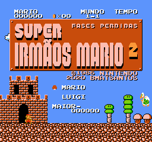

# Super Mario Bros.: The Lost Levels

## Informações sobre o jogo

| Tipo | Informação |
| ----------- | ----------- |
| Nome | [Super Mario Bros.: The Lost Levels](https://www.mobygames.com/game/27861/super-mario-bros-2/) |
| Plataforma | [Famicom Disk System](../../famicom-disk-system/) |
| Desenvolvedora | Nintendo |
| Distribuidora | Nintendo |
| Gênero | Ação / Plataforma |
| Data de Lançamento | 03/06/1986 |

## Informações sobre a tradução

| Tipo | Informação |
| ----------- | ----------- |
| Versão | 1.0 |
| Última versão | Sim |
| URL Youtube | [https://youtu.be/0soSpE17GLc](https://youtu.be/0soSpE17GLc) |
| Data de Lançamento | 21/12/2020 |
| Percentual traduzido | 100% |

## Autores

| Autor(a) | Papel na tradução |
| ----------- | ----------- |
| [BMatSantos](../../../autores/bmatsantos/) | Completo |

## Informações sobre patching

| Aplicar o patch no arquivo | CRC32 Hash | MD5 Hash |
| ----------- | ----------- | ----------- |
| Super Mario Brothers 2 (Japan) (En) | F04CD4CD | 7F38210A8A2BEFB8D347523B4FF6AE7C |

## Páginas sobre a tradução

| URL | Oficial (publicado pelos autores) | Possuí link de download |
| ----------- | ----------- | ----------- |
| [https://www.romhacking.net/translations/5821/](https://www.romhacking.net/translations/5821/) | Sim | Sim |
| [https://www.romhacking.net.br/index.php?topic=1698](https://www.romhacking.net.br/index.php?topic=1698) | Sim | Sim, porém é necessário realizar login |
| [https://joao13traducoes.com/2020/12/fds-super-mario-bros-lost-levels/](https://joao13traducoes.com/2020/12/fds-super-mario-bros-lost-levels/) | Não | Sim, porém o arquivo ou página de download exige uma senha |

## Imagens da tradução

