# 2 in 1 - Asterix &amp; Obelix - Bash Them All! + Asterix &amp; Obelix XXL

## Informações sobre o jogo

| Tipo | Informação |
| ----------- | ----------- |
| Nome | 2 in 1 \- Asterix &amp; Obelix \- Bash Them All\! \+ Asterix &amp; Obelix XXL |
| Plataforma | [Game Boy Advance](../) |
| Desenvolvedora | Bit Managers |
| Distribuidora | Atari |
| Gênero | Beat 'em up |
| Data de Lançamento | 23/06/2004 |

## Informações sobre a tradução

| Tipo | Informação |
| ----------- | ----------- |
| Versão | 1\.0 |
| Última versão | Sim |
| Data de Lançamento | 13/11/2009 |
| Percentual traduzido | 99% |

## Autores

| Autor(a) | Papel na tradução |
| ----------- | ----------- |
| [Kratos\-AM](../../../autores/kratos-am/) | Completo |

## Informações sobre patching

| Aplicar o patch no arquivo | CRC32 Hash | MD5 Hash |
| ----------- | ----------- | ----------- |
| 2 in 1 \- Asterix and Obelix \(E\) \(Rising Sun\)\.gba | 183A2207 | EAB287293BF4B62301119CFC3A9A9CCC |

## Páginas sobre a tradução

| URL | Oficial (publicado pelos autores) | Possuí link de download |
| ----------- | ----------- | ----------- |
| [https://romhackers.org/traducoes/portatil/game-boy-advance/asterix-and-obelix-2-in-1-kratos-am/](https://romhackers.org/traducoes/portatil/game-boy-advance/asterix-and-obelix-2-in-1-kratos-am/) | Não | Sim |
| [https://www.zophar.net/translations/gameboy-advance/brazilian-portuguese/2-in-1-asterix-obelix-bash-them-all-asterix-obelix-xxl.html](https://www.zophar.net/translations/gameboy-advance/brazilian-portuguese/2-in-1-asterix-obelix-bash-them-all-asterix-obelix-xxl.html) | Não | Sim |

## Imagens da tradução

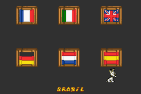
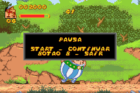
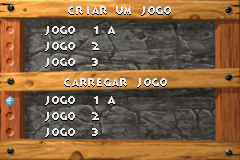
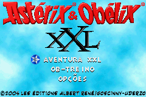
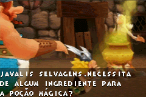
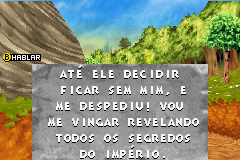
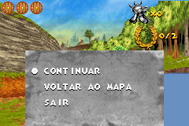
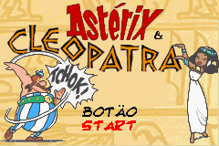

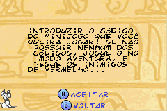
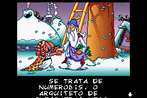
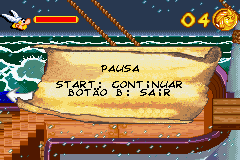

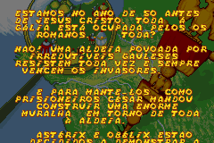
