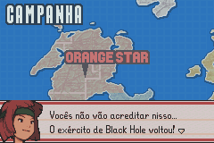

# Advance Wars 2 - Black Hole Rising

## Informações sobre o jogo

| Tipo | Informação |
| ----------- | ----------- |
| Nome | Advance Wars 2 \- Black Hole Rising |
| Plataforma | [Game Boy Advance](../) |
| Desenvolvedora | Intelligent Systems |
| Distribuidora | Nintendo |
| Gênero | Estratégia |
| Data de Lançamento | 03/10/2003 |

## Informações sobre a tradução

| Tipo | Informação |
| ----------- | ----------- |
| Versão | 1\.0 |
| Última versão | Sim |
| Data de Lançamento | 28/09/2016 |
| Percentual traduzido | 100% |

## Autores

| Autor(a) | Papel na tradução |
| ----------- | ----------- |
| [Lucjedi](../../../autores/lucjedi/) | Completo |

## Grupos

* [Trans\-Center](../../../grupos/trans-center/)

## Informações sobre patching

| Aplicar o patch no arquivo | CRC32 Hash | MD5 Hash |
| ----------- | ----------- | ----------- |
| Advance Wars 2 \- Black Hole Rising \(E\)\(Surplus\)\.gba | 5A09AAE6 | AD4CF738F97416827BAF17D6C43576D7 |

## Páginas sobre a tradução

| URL | Oficial (publicado pelos autores) | Possuí link de download |
| ----------- | ----------- | ----------- |
| [http://www.lucjedi.com/2016/09/traducao-advance-wars-2-black-hole.html](http://www.lucjedi.com/2016/09/traducao-advance-wars-2-black-hole.html) | Sim | Sim |
| [https://romhackers.org/traducoes/portatil/game-boy-advance/advance-wars-2-black-hole-rising-trans-center/](https://romhackers.org/traducoes/portatil/game-boy-advance/advance-wars-2-black-hole-rising-trans-center/) | Não | Sim |

## Imagens da tradução

