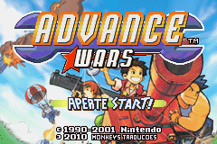
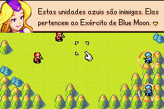

# Advance Wars

## Informações sobre o jogo

| Tipo | Informação |
| ----------- | ----------- |
| Nome | Advance Wars |
| Plataforma | [Game Boy Advance](../) |
| Desenvolvedora | Intelligent Systems |
| Distribuidora | Nintendo |
| Gênero | Estratégia |
| Data de Lançamento | 09/09/2001 |

## Informações sobre a tradução

| Tipo | Informação |
| ----------- | ----------- |
| Versão | Revisão 2 |
| Última versão | Sim |
| Data de Lançamento | 09/01/2010 |
| Percentual traduzido | 100% |

## Autores

| Autor(a) | Papel na tradução |
| ----------- | ----------- |
| [DiegoHH](../../../autores/diegohh/) | Tradução e Gráficos |
| [Knirt](../../../autores/knirt/) | Revisão |
| [Marvin Dalkiri](../../../autores/marvin-dalkiri/) | Revisão |

## Grupos

* [Monkey's Traduções](../../../grupos/monkeys-traducoes/)

## Informações sobre patching

| Aplicar o patch no arquivo | CRC32 Hash | MD5 Hash |
| ----------- | ----------- | ----------- |
| Advance Wars \(U\) \(V1\.0\)\.gba | DBEF116C | 27F322F5CD535297AB21BC4A41CBFC12 |

## Páginas sobre a tradução

| URL | Oficial (publicado pelos autores) | Possuí link de download |
| ----------- | ----------- | ----------- |
| [https://romhackers.org/traducoes/portatil/game-boy-advance/advance-wars-monkeys-traducoes/](https://romhackers.org/traducoes/portatil/game-boy-advance/advance-wars-monkeys-traducoes/) | Não | Sim |
| [https://www.romhacking.net/translations/1480/](https://www.romhacking.net/translations/1480/) | Não | Sim |

## Imagens da tradução

