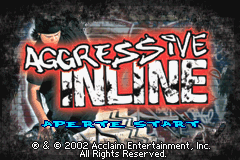
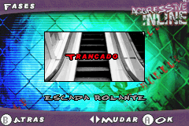
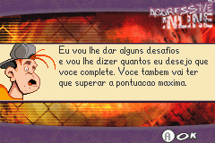

# Aggressive Inline

## Informações sobre o jogo

| Tipo | Informação |
| ----------- | ----------- |
| Nome | Aggressive Inline |
| Plataforma | [Game Boy Advance](../) |
| Desenvolvedora | Full Fat |
| Distribuidora | Acclaim |
| Gênero | Esportes |
| Data de Lançamento | 27/08/2002 |

## Informações sobre a tradução

| Tipo | Informação |
| ----------- | ----------- |
| Última versão | Sim |
| Data de Lançamento | 04/10/2012 |
| Percentual traduzido | None% |

## Autores

| Autor(a) | Papel na tradução |
| ----------- | ----------- |
| [Xandinho](../../../autores/xandinho/) | Completo |

## Informações sobre patching

| Aplicar o patch no arquivo | CRC32 Hash | MD5 Hash |
| ----------- | ----------- | ----------- |
| Aggressive Inline \(U\)\.gba | 3A44FCD5 | 4E8B17BB4B77CD5568B678596C55A8BB |

## Páginas sobre a tradução

| URL | Oficial (publicado pelos autores) | Possuí link de download |
| ----------- | ----------- | ----------- |
| [https://romhackers.org/traducoes/portatil/game-boy-advance/agressive-inline-xandinho/](https://romhackers.org/traducoes/portatil/game-boy-advance/agressive-inline-xandinho/) | Não | Sim |

## Imagens da tradução

