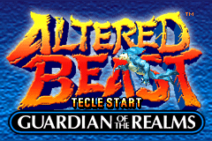
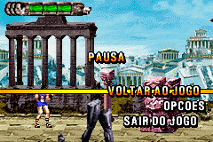

# Altered Beast - Guardian of the Realms

## Informações sobre o jogo

| Tipo | Informação |
| ----------- | ----------- |
| Nome | Altered Beast \- Guardian of the Realms |
| Plataforma | [Game Boy Advance](../) |
| Desenvolvedora | 3d6 Games |
| Distribuidora | SEGA |
| Gênero | Beat 'em up |
| Data de Lançamento | 25/07/2003 |

## Informações sobre a tradução

| Tipo | Informação |
| ----------- | ----------- |
| Versão | 1\.0 |
| Última versão | Sim |
| Data de Lançamento | 08/11/2017 |
| Percentual traduzido | 80% |

## Autores

| Autor(a) | Papel na tradução |
| ----------- | ----------- |
| [ripman](../../../autores/ripman/) | Completo |

## Informações sobre patching

| Aplicar o patch no arquivo | CRC32 Hash | MD5 Hash |
| ----------- | ----------- | ----------- |
| Altered Beast \- Guardian of the Realms \(Europe\) \(En,Fr,De,Es,It\)\.gba | 654F7916 | C7C56AAED390488E4112EF64B51BB2AD |

## Páginas sobre a tradução

| URL | Oficial (publicado pelos autores) | Possuí link de download |
| ----------- | ----------- | ----------- |
| [https://romhackers.org/traducoes/portatil/game-boy-advance/altered-beast-guardian-of-the-realms-ripman/](https://romhackers.org/traducoes/portatil/game-boy-advance/altered-beast-guardian-of-the-realms-ripman/) | Não | Sim |

## Imagens da tradução

