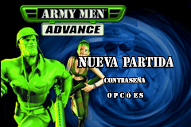
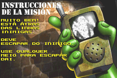
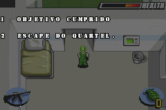

# Army Men Advance

## Informações sobre o jogo

| Tipo | Informação |
| ----------- | ----------- |
| Nome | Army Men Advance |
| Plataforma | [Game Boy Advance](../) |
| Desenvolvedora | DC Studios |
| Distribuidora | 3DO |
| Gênero | Run 'n gun |
| Data de Lançamento | 10/06/2001 |

## Informações sobre a tradução

| Tipo | Informação |
| ----------- | ----------- |
| Última versão | Sim |
| Data de Lançamento | (Provavelmente) 18/11/2001 |
| Percentual traduzido | 98% |

## Autores

| Autor(a) | Papel na tradução |
| ----------- | ----------- |
| [Lohan](../../../autores/lohan/) | Completo |

## Grupos

* [Evil Darkness](../../../grupos/evil-darkness/)

## Informações sobre patching

| Aplicar o patch no arquivo | CRC32 Hash | MD5 Hash |
| ----------- | ----------- | ----------- |
| Army Men Advance \(UE\) \(M5\) \[\!\]\.gba | 9A4A509F | 30FF69A44658FCF2CC381736403E74EF |

## Páginas sobre a tradução

| URL | Oficial (publicado pelos autores) | Possuí link de download |
| ----------- | ----------- | ----------- |
| [https://romhackers.org/traducoes/portatil/game-boy-advance/army-men-advance-evil-darkness/](https://romhackers.org/traducoes/portatil/game-boy-advance/army-men-advance-evil-darkness/) | Não | Sim |
| [https://www.zophar.net/translations/gameboy-advance/brazilian-portuguese/army-men-advance.html](https://www.zophar.net/translations/gameboy-advance/brazilian-portuguese/army-men-advance.html) | Não | Sim |
| [https://joao13traducoes.com/2022/03/gba-army-men-advance-evil-darkness/](https://joao13traducoes.com/2022/03/gba-army-men-advance-evil-darkness/) | Não | Sim, porém o arquivo ou página de download exige uma senha |

## Imagens da tradução

