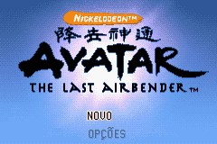
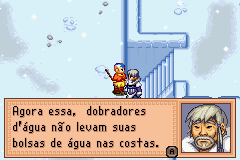
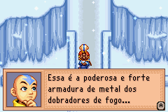

# Avatar - The Last Airbender

## Informações sobre o jogo

| Tipo | Informação |
| ----------- | ----------- |
| Nome | Avatar \- The Last Airbender |
| Plataforma | [Game Boy Advance](../) |
| Desenvolvedora | Halfbrick |
| Distribuidora | THQ |
| Gênero | RPG / Ação |
| Data de Lançamento | 10/10/2006 |

## Informações sobre a tradução

| Tipo | Informação |
| ----------- | ----------- |
| Última versão | Sim |
| Data de Lançamento | 24/02/2010 |
| Percentual traduzido | None% |

## Autores

| Autor(a) | Papel na tradução |
| ----------- | ----------- |
| [Tony Paixão](../../../autores/tony-paixao/) | Completo |

## Informações sobre patching

| Aplicar o patch no arquivo | CRC32 Hash | MD5 Hash |
| ----------- | ----------- | ----------- |
| Avatar \- The Last Airbender \(U\)\.gba | 946787C0 | C19779D04914FAE7268BFB8B47B8B048 |

## Páginas sobre a tradução

| URL | Oficial (publicado pelos autores) | Possuí link de download |
| ----------- | ----------- | ----------- |
| [https://www.zophar.net/translations/gameboy-advance/brazilian-portuguese/avatar-the-last-airbender.html](https://www.zophar.net/translations/gameboy-advance/brazilian-portuguese/avatar-the-last-airbender.html) | Não | Sim |
| [https://romhackers.org/traducoes/portatil/game-boy-advance/avatar-the-last-airbender-tony-paixao/](https://romhackers.org/traducoes/portatil/game-boy-advance/avatar-the-last-airbender-tony-paixao/) | Não | Não |

## Imagens da tradução

