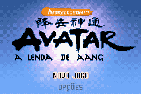
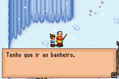
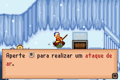

# Avatar - The Legend of Aang

## Informações sobre o jogo

| Tipo | Informação |
| ----------- | ----------- |
| Nome | Avatar \- The Legend of Aang |
| Plataforma | [Game Boy Advance](../) |
| Desenvolvedora | Halfbrick |
| Distribuidora | THQ |
| Gênero | RPG / Ação |
| Data de Lançamento | 09/02/2007 |

## Informações sobre a tradução

| Tipo | Informação |
| ----------- | ----------- |
| Última versão | Sim |
| Data de Lançamento | 02/09/2012 |
| Percentual traduzido | 100% |

## Autores

| Autor(a) | Papel na tradução |
| ----------- | ----------- |
| [Luccasdavid](../../../autores/luccasdavid/) | Completo |

## Grupos

* [Disco Voador Romhacking](../../../grupos/disco-voador-romhacking/)

## Informações sobre patching

| Aplicar o patch no arquivo | CRC32 Hash | MD5 Hash |
| ----------- | ----------- | ----------- |
| Avatar \- The Legend of Aang \(E\) \(M4\)\.gba | 52FE8A62 | EF9198E16C58C4824EFAE668DA1E7040 |

## Páginas sobre a tradução

| URL | Oficial (publicado pelos autores) | Possuí link de download |
| ----------- | ----------- | ----------- |
| [https://romhackers.org/traducoes/portatil/game-boy-advance/avatar-the-legend-of-aang-disco-voador-romhack/](https://romhackers.org/traducoes/portatil/game-boy-advance/avatar-the-legend-of-aang-disco-voador-romhack/) | Não | Sim |

## Imagens da tradução

