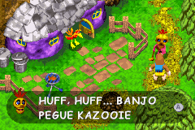
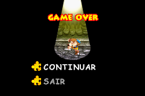

# Banjo-Kazooie - Grunty's Revenge

## Informações sobre o jogo

| Tipo | Informação |
| ----------- | ----------- |
| Nome | Banjo\-Kazooie \- Grunty's Revenge |
| Plataforma | [Game Boy Advance](../) |
| Desenvolvedora | Rare |
| Distribuidora | THQ |
| Gênero | Ação / Plataforma |
| Data de Lançamento | 10/09/2003 |

## Informações sobre a tradução

| Tipo | Informação |
| ----------- | ----------- |
| Versão | 2\.0 |
| Última versão | Sim |
| Data de Lançamento | 18/02/2018 |
| Percentual traduzido | 90% |

## Autores

| Autor(a) | Papel na tradução |
| ----------- | ----------- |
| [FL\_LOKO](../../../autores/fl_loko/) | Completo |

## Informações sobre patching

| Aplicar o patch no arquivo | CRC32 Hash | MD5 Hash |
| ----------- | ----------- | ----------- |
| Banjo\-Kazooie \- Grunty's Revenge \(U\) \[\!\]\.gba | DFB5ABA3 | 4781A8E513DE51AB90292C321AC34374 |

## Páginas sobre a tradução

| URL | Oficial (publicado pelos autores) | Possuí link de download |
| ----------- | ----------- | ----------- |
| [https://www.romhacking.net.br/index.php?topic=507](https://www.romhacking.net.br/index.php?topic=507) | Sim | Sim, porém é necessário realizar login |
| [https://romhackers.org/traducoes/portatil/game-boy-advance/banjo-kazooie-gruntys-revenge-fl-loko/](https://romhackers.org/traducoes/portatil/game-boy-advance/banjo-kazooie-gruntys-revenge-fl-loko/) | Não | Não |
| [https://joao13traducoes.com/2018/02/gba-banjo-kazooie-grunty-revenge-fl-loko/](https://joao13traducoes.com/2018/02/gba-banjo-kazooie-grunty-revenge-fl-loko/) | Não | Sim, porém o arquivo ou página de download exige uma senha |

## Imagens da tradução

