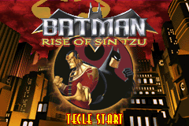
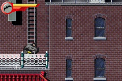

# Batman - Rise of Sin Tzu

## Informações sobre o jogo

| Tipo | Informação |
| ----------- | ----------- |
| Nome | Batman \- Rise of Sin Tzu |
| Plataforma | [Game Boy Advance](../) |
| Desenvolvedora | Ubisoft |
| Distribuidora | Ubisoft |
| Gênero | Beat 'em up |
| Data de Lançamento | 14/10/2003 |

## Informações sobre a tradução

| Tipo | Informação |
| ----------- | ----------- |
| Última versão | Sim |
| Data de Lançamento | 25/06/2005 |
| Percentual traduzido | 100% |

## Autores

| Autor(a) | Papel na tradução |
| ----------- | ----------- |
| [Mestre Splinter](../../../autores/mestre-splinter/) | Completo |
| [Goku ssj4](../../../autores/goku-ssj4/) | Completo |

## Grupos

* [TransFac](../../../grupos/transfac/)

## Informações sobre patching

| Aplicar o patch no arquivo | CRC32 Hash | MD5 Hash |
| ----------- | ----------- | ----------- |
| Batman \- Rise of Sin Tzu \(U\) \(M3\) \[hI\]\.gba | 9AE450C4 | B980D738CD7E4978CF7C8A53FF0ECE58 |

## Páginas sobre a tradução

| URL | Oficial (publicado pelos autores) | Possuí link de download |
| ----------- | ----------- | ----------- |
| [https://www.zophar.net/translations/gameboy-advance/brazilian-portuguese/batman-rise-of-sin-tzu.html](https://www.zophar.net/translations/gameboy-advance/brazilian-portuguese/batman-rise-of-sin-tzu.html) | Não | Sim |
| [https://romhackers.org/traducoes/portatil/game-boy-advance/batman-rise-of-sin-tzu-transfac/](https://romhackers.org/traducoes/portatil/game-boy-advance/batman-rise-of-sin-tzu-transfac/) | Não | Não |

## Imagens da tradução

