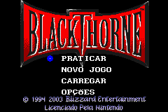
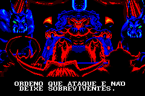
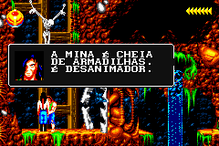

# BlackThorne

## Informações sobre o jogo

| Tipo | Informação |
| ----------- | ----------- |
| Nome | BlackThorne |
| Plataforma | [Game Boy Advance](../) |
| Desenvolvedora | Mass Media |
| Distribuidora | Blizzard |
| Gênero | Ação / Tiro |
| Data de Lançamento | (Por volta de) ??/??/2003 |

## Informações sobre a tradução

| Tipo | Informação |
| ----------- | ----------- |
| Última versão | Sim |
| Data de Lançamento | 04/01/2009 |
| Percentual traduzido | 100% |

## Autores

| Autor(a) | Papel na tradução |
| ----------- | ----------- |
| [Mr\. Magoo](../../../autores/mr-magoo/) | Completo |

## Informações sobre patching

| Aplicar o patch no arquivo | CRC32 Hash | MD5 Hash |
| ----------- | ----------- | ----------- |
| BlackThorne \(U\)\.gba | 8E6DCD53 | D0BB79FB5A05702CE8B7D03320FCDF52 |

## Páginas sobre a tradução

| URL | Oficial (publicado pelos autores) | Possuí link de download |
| ----------- | ----------- | ----------- |
| [https://www.zophar.net/translations/gameboy-advance/brazilian-portuguese/blackthorne.html](https://www.zophar.net/translations/gameboy-advance/brazilian-portuguese/blackthorne.html) | Não | Sim |
| [https://romhackers.org/traducoes/portatil/game-boy-advance/blackthorne-mr.magoo/](https://romhackers.org/traducoes/portatil/game-boy-advance/blackthorne-mr.magoo/) | Não | Não |

## Imagens da tradução

