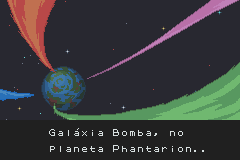
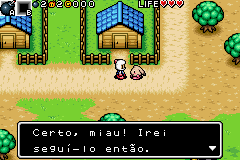
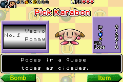

# Bomberman Tournament

## Informações sobre o jogo

| Tipo | Informação |
| ----------- | ----------- |
| Nome | Bomberman Tournament |
| Plataforma | [Game Boy Advance](../) |
| Desenvolvedora | Hudson |
| Distribuidora | Activision |
| Gênero | RPG / Ação |
| Data de Lançamento | 26/06/2001 |

## Informações sobre a tradução

| Tipo | Informação |
| ----------- | ----------- |
| Versão | 1\.2 |
| Última versão | Sim |
| Data de Lançamento | 27/11/2001 |
| Percentual traduzido | 100% |

## Autores

| Autor(a) | Papel na tradução |
| ----------- | ----------- |
| [Odin](../../../autores/odin/) | ROMHacking, Testes e Revisor |
| [\{Shadow\_Jake\}](../../../autores/shadow_jake/) | Tradução e revisão |

## Grupos

* [Hexagon](../../../grupos/hexagon/)

## Informações sobre patching

| Formato do patch | Aplicar o patch no arquivo | CRC32 Hash | MD5 Hash |
| ----------- | ----------- | ----------- | ----------- |
| IPS | Bomberman Tournament \(U\) \[\!\]\.gba | 240282E6 | 79AEF9BBE1378ADFBD688CD66E11A7BE |

## Páginas sobre a tradução

| URL | Oficial (publicado pelos autores) | Possuí link de download |
| ----------- | ----------- | ----------- |
| [https://www.zophar.net/translations/gameboy-advance/portuguese/bomberman-tournament.html](https://www.zophar.net/translations/gameboy-advance/portuguese/bomberman-tournament.html) | Não | Sim |
| [https://romhackers.org/traducoes/portatil/game-boy-advance/bomberman-tournament-hexagon/](https://romhackers.org/traducoes/portatil/game-boy-advance/bomberman-tournament-hexagon/) | Não | Não |
| [https://joao13traducoes.com/2022/03/gba-bomberman-tournament-hexagon/](https://joao13traducoes.com/2022/03/gba-bomberman-tournament-hexagon/) | Não | Sim, porém o arquivo ou página de download exige uma senha |

## Imagens da tradução

