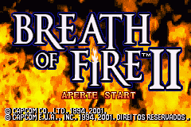
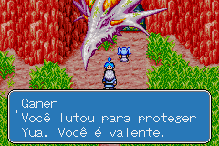
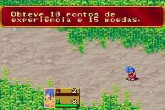

# Breath of Fire II

## Informações sobre o jogo

| Tipo | Informação |
| ----------- | ----------- |
| Nome | Breath of Fire II |
| Plataforma | [Game Boy Advance](../) |
| Desenvolvedora | Capcom |
| Distribuidora | Capcom |
| Gênero | RPG / Turno |
| Data de Lançamento | 16/04/2002 |

## Informações sobre a tradução

| Tipo | Informação |
| ----------- | ----------- |
| Versão | 1\.0 |
| Última versão | Sim |
| Data de Lançamento | 15/02/2015 |
| Percentual traduzido | 100% |

## Autores

| Autor(a) | Papel na tradução |
| ----------- | ----------- |
| [Kamppello](../../../autores/kamppello/) | Completo |
| [Fou\-Lu](../../../autores/fou-lu/) | Completo |
| [Colt\_93](../../../autores/colt_93/) | Tradução |
| [Kretzer](../../../autores/kretzer/) | Tradução |
| [Dorzer](../../../autores/dorzer/) | Tradução |
| [Fred](../../../autores/fred/) | Tradução |
| [Deid](../../../autores/deid/) | Tradução |
| [wazyu](../../../autores/wazyu/) | Tradução |
| [Giuliano Vieira](../../../autores/giuliano-vieira/) | Tradução |

## Grupos

* [Nintendo BR](../../../grupos/nintendo-br/)

## Informações sobre patching

| Aplicar o patch no arquivo | CRC32 Hash | MD5 Hash |
| ----------- | ----------- | ----------- |
| Breath of Fire II \(U\) \[\!\]\.gba | 6F098DA3 | 2132B06357239D4E6A0716D963F46597 |

## Páginas sobre a tradução

| URL | Oficial (publicado pelos autores) | Possuí link de download |
| ----------- | ----------- | ----------- |
| [https://nbr-traducoes.blogspot.com/2015/02/traducao-do-breath-of-fire-ii-concluida.html](https://nbr-traducoes.blogspot.com/2015/02/traducao-do-breath-of-fire-ii-concluida.html) | Sim | Não |
| [https://romhackers.org/traducoes/portatil/game-boy-advance/breath-of-fire-ii-nintendo-br/](https://romhackers.org/traducoes/portatil/game-boy-advance/breath-of-fire-ii-nintendo-br/) | Não | Sim |

## Imagens da tradução

