# Castlevania - Aria of Sorrow

## Informações sobre o jogo

| Tipo | Informação |
| ----------- | ----------- |
| Nome | Castlevania \- Aria of Sorrow |
| Plataforma | [Game Boy Advance](../) |
| Desenvolvedora | Konami |
| Distribuidora | Konami |
| Gênero | Metroidvania |
| Data de Lançamento | 09/05/2003 |

## Informações sobre a tradução

| Tipo | Informação |
| ----------- | ----------- |
| Versão | 2\.2 |
| Última versão | Sim |
| Observação | Se por acaso alguém escolher o idioma francês ou alemão, eles estarão com uns caracteres estranhos, sem falar que talvez parte dos gráficos estejam em português ao invés de alemão ou francês\. |
| Data de Lançamento | 11/11/2017 |
| Percentual traduzido | 100% |

## Autores

| Autor(a) | Papel na tradução |
| ----------- | ----------- |
| [Solid\_One](../../../autores/solid_one/) | Completo |
| [spyblack](../../../autores/spyblack/) | Romhacking |
| [Fallen\_Soul](../../../autores/fallen_soul/) | Romhacking |
| [Kmikz](../../../autores/kmikz/) | Romhacking |

## Grupos

* [Trans\-Center](../../../grupos/trans-center/)

## Informações sobre patching

| Formato do patch | Aplicar o patch no arquivo | CRC32 Hash | MD5 Hash |
| ----------- | ----------- | ----------- | ----------- |
| IPS | Castlevania \- Aria of Sorrow \(E\) \(M3\) \[hIR00\]\.gba | D0C91F74 | 4A5D8E686D55829D54A03FDA8D6887D7 |

## Páginas sobre a tradução

| URL | Oficial (publicado pelos autores) | Possuí link de download |
| ----------- | ----------- | ----------- |
| [https://www.romhacking.net.br/index.php?topic=370](https://www.romhacking.net.br/index.php?topic=370) | Sim | Sim, porém é necessário realizar login |
| [https://www.romhacking.net/translations/5167/](https://www.romhacking.net/translations/5167/) | Não | Sim |
| [https://romhackers.org/traducoes/portatil/game-boy-advance/castlevania-aria-of-sorrow-trans-center/](https://romhackers.org/traducoes/portatil/game-boy-advance/castlevania-aria-of-sorrow-trans-center/) | Não | Não |
| [https://joao13traducoes.com/2018/03/gba-castlevania-circle-of-the-moon-trans-center-e-pobre/](https://joao13traducoes.com/2018/03/gba-castlevania-circle-of-the-moon-trans-center-e-pobre/) | Não | Sim, porém o arquivo ou página de download exige uma senha |

## Imagens da tradução

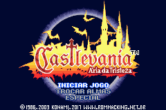
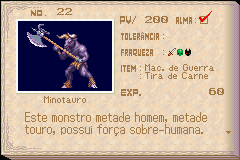
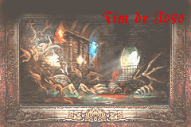
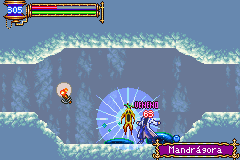
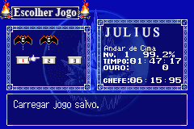
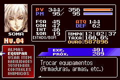
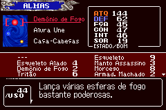
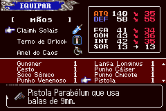
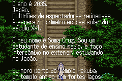
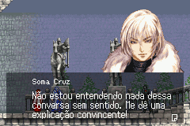
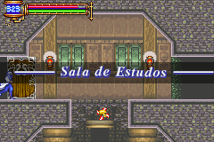
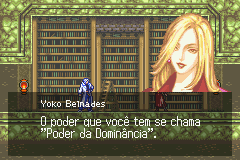