# Castlevania - Circle of the Moon

## Informações sobre o jogo

| Tipo | Informação |
| ----------- | ----------- |
| Nome | Castlevania \- Circle of the Moon |
| Plataforma | [Game Boy Advance](../) |
| Desenvolvedora | Konami |
| Distribuidora | Konami |
| Gênero | Metroidvania |
| Data de Lançamento | 10/06/2001 |

## Informações sobre a tradução

| Tipo | Informação |
| ----------- | ----------- |
| Versão | 1\.0 |
| Última versão | Sim |
| Data de Lançamento | 24/12/2010 |
| Percentual traduzido | 99% |

## Autores

| Autor(a) | Papel na tradução |
| ----------- | ----------- |
| [Solid\_One](../../../autores/solid_one/) | Completo |
| [Joapeer](../../../autores/joapeer/) | Romhacking |
| [Arara](../../../autores/arara/) | Revisão |
| [spyblack](../../../autores/spyblack/) | Revisão |

## Grupos

* [Trans\-Center](../../../grupos/trans-center/)
* [PO\.B\.R\.E](../../../grupos/pobre/)

## Informações sobre patching

| Aplicar o patch no arquivo | CRC32 Hash | MD5 Hash |
| ----------- | ----------- | ----------- |
| Castlevania \- Circle of the Moon \(U\)\.gba | 1CC059A4 | 50A1089600603A94E15ECF287F8D5A1F |

## Páginas sobre a tradução

| URL | Oficial (publicado pelos autores) | Possuí link de download |
| ----------- | ----------- | ----------- |
| [https://www.romhacking.net/translations/5179/](https://www.romhacking.net/translations/5179/) | Não | Sim |
| [https://www.zophar.net/translations/gameboy-advance/brazilian-portuguese/castlevania-circle-of-the-moon.html](https://www.zophar.net/translations/gameboy-advance/brazilian-portuguese/castlevania-circle-of-the-moon.html) | Não | Sim |
| [https://romhackers.org/traducoes/portatil/game-boy-advance/castlevania-circle-of-the-moon-trans-center-e-po.b.r.e](https://romhackers.org/traducoes/portatil/game-boy-advance/castlevania-circle-of-the-moon-trans-center-e-po.b.r.e) | Não | Não |
| [https://joao13traducoes.com/2018/03/gba-castlevania-circle-of-the-moon-trans-center-e-pobre/](https://joao13traducoes.com/2018/03/gba-castlevania-circle-of-the-moon-trans-center-e-pobre/) | Não | Sim, porém o arquivo ou página de download exige uma senha |

## Imagens da tradução

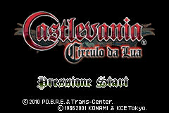

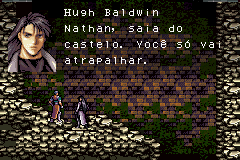
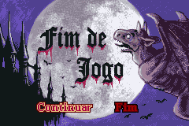
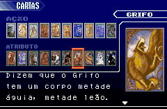
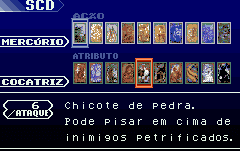
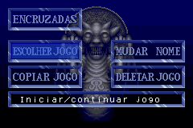
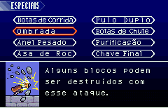
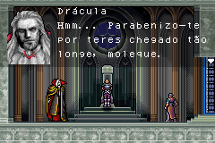
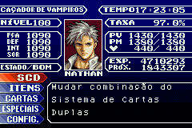
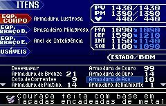
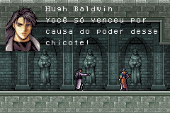