# Castlevania - Harmony of Dissonance

## Informações sobre o jogo

| Tipo | Informação |
| ----------- | ----------- |
| Nome | Castlevania \- Harmony of Dissonance |
| Plataforma | [Game Boy Advance](../) |
| Desenvolvedora | Konami |
| Distribuidora | Konami |
| Gênero | Metroidvania |
| Data de Lançamento | 11/10/2002 |

## Informações sobre a tradução

| Tipo | Informação |
| ----------- | ----------- |
| Versão | 1\.1 |
| Última versão | Sim |
| Data de Lançamento | 21/03/2008 |
| Percentual traduzido | 100% |

## Autores

| Autor(a) | Papel na tradução |
| ----------- | ----------- |
| [Solid\_One](../../../autores/solid_one/) | Completo |
| [Anime\_World](../../../autores/anime_world/) | Romhacking |
| [Darkl0rd](../../../autores/darkl0rd/) | Revisão |
| [Odin](../../../autores/odin/) | Gráficos |

## Grupos

* [Trans\-Center](../../../grupos/trans-center/)

## Informações sobre patching

| Aplicar o patch no arquivo | CRC32 Hash | MD5 Hash |
| ----------- | ----------- | ----------- |
| Castlevania \- Harmony of Dissonance \(E\) \[\!\]\.gba | 521B3091 | E619F9DCD7EF3D4C6851834018B139BD |

## Páginas sobre a tradução

| URL | Oficial (publicado pelos autores) | Possuí link de download |
| ----------- | ----------- | ----------- |
| [https://www.romhacking.net/translations/5178/](https://www.romhacking.net/translations/5178/) | Não | Sim |
| [https://www.zophar.net/translations/gameboy-advance/brazilian-portuguese/castlevania-harmony-of-dissonance.html](https://www.zophar.net/translations/gameboy-advance/brazilian-portuguese/castlevania-harmony-of-dissonance.html) | Não | Sim |
| [https://romhackers.org/traducoes/portatil/game-boy-advance/castlevania-harmony-of-dissonance-trans-center/](https://romhackers.org/traducoes/portatil/game-boy-advance/castlevania-harmony-of-dissonance-trans-center/) | Não | Não |
| [https://joao13traducoes.com/2018/03/gba-castlevania-harmony-of-dissonance-trans-center/](https://joao13traducoes.com/2018/03/gba-castlevania-harmony-of-dissonance-trans-center/) | Não | Sim, porém o arquivo ou página de download exige uma senha |

## Imagens da tradução

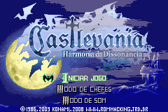
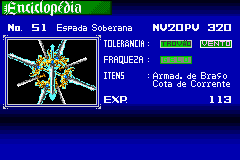
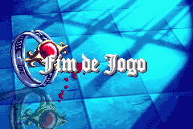
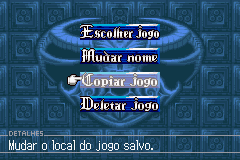
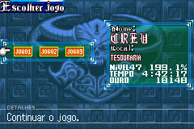
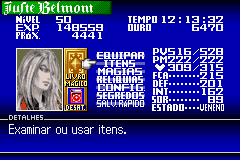
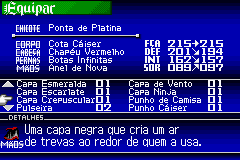
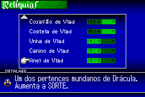

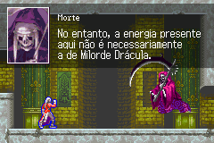
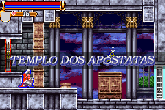
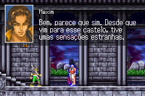