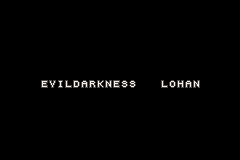
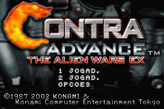
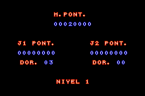

# Contra Advance - The Alien Wars EX

## Informações sobre o jogo

| Tipo | Informação |
| ----------- | ----------- |
| Nome | Contra Advance \- The Alien Wars EX |
| Plataforma | [Game Boy Advance](../) |
| Desenvolvedora | Konami |
| Distribuidora | Konami |
| Gênero | Run 'n gun |
| Data de Lançamento | 03/11/2002 |

## Informações sobre a tradução

| Tipo | Informação |
| ----------- | ----------- |
| Versão | 1\.0 |
| Última versão | Sim |
| Data de Lançamento | 09/03/2003 |
| Percentual traduzido | None% |

## Autores

| Autor(a) | Papel na tradução |
| ----------- | ----------- |
| [Lohan](../../../autores/lohan/) | Completo |

## Grupos

* [Evil Darkness](../../../grupos/evil-darkness/)

## Informações sobre patching

| Aplicar o patch no arquivo | CRC32 Hash | MD5 Hash |
| ----------- | ----------- | ----------- |
| Contra Advance \- The Alien Wars EX \(U\) \[hI\]\.gba | D280B988 | DEB9740C2871D0729A9B00386D22DBA6 |

## Páginas sobre a tradução

| URL | Oficial (publicado pelos autores) | Possuí link de download |
| ----------- | ----------- | ----------- |
| [https://www.zophar.net/translations/gameboy-advance/brazilian-portuguese/contra-advance-the-alien-wars-ex-exj.html](https://www.zophar.net/translations/gameboy-advance/brazilian-portuguese/contra-advance-the-alien-wars-ex-exj.html) | Não | Sim |
| [https://romhackers.org/traducoes/portatil/game-boy-advance/contra-advance-the-alien-wars-ex-evil-darkness/](https://romhackers.org/traducoes/portatil/game-boy-advance/contra-advance-the-alien-wars-ex-evil-darkness/) | Não | Não |

## Imagens da tradução

