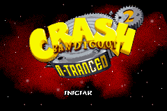
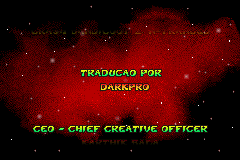
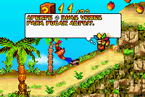

# Crash Bandicoot 2 - N-Tranced

## Informações sobre o jogo

| Tipo | Informação |
| ----------- | ----------- |
| Nome | Crash Bandicoot 2 \- N\-Tranced |
| Plataforma | [Game Boy Advance](../) |
| Desenvolvedora | Vicarious Visions |
| Distribuidora | Universal Interactive |
| Gênero | Ação / Plataforma |
| Data de Lançamento | 07/01/2003 |

## Informações sobre a tradução

| Tipo | Informação |
| ----------- | ----------- |
| Última versão | Sim |
| Data de Lançamento | (Por volta de) ??/02/2003 |
| Percentual traduzido | None% |

## Autores

| Autor(a) | Papel na tradução |
| ----------- | ----------- |
| [DarkPro](../../../autores/darkpro/) | Completo |

## Informações sobre patching

| Aplicar o patch no arquivo | CRC32 Hash | MD5 Hash |
| ----------- | ----------- | ----------- |
| Crash Bandicoot 2 \- N\-Tranced \(U\)\.gba | 2E16184A | 617B2B2590E2925228DBDB162B05D6F6 |

## Páginas sobre a tradução

| URL | Oficial (publicado pelos autores) | Possuí link de download |
| ----------- | ----------- | ----------- |
| [https://romhackers.org/traducoes/portatil/game-boy-advance/crash-bandicoot-2-n-tranced-darkpro/](https://romhackers.org/traducoes/portatil/game-boy-advance/crash-bandicoot-2-n-tranced-darkpro/) | Não | Sim |
| [https://www.zophar.net/translations/gameboy-advance/brazilian-portuguese/crash-bandicoot-2-n-tranced.html](https://www.zophar.net/translations/gameboy-advance/brazilian-portuguese/crash-bandicoot-2-n-tranced.html) | Não | Sim |

## Imagens da tradução

