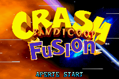
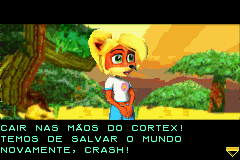
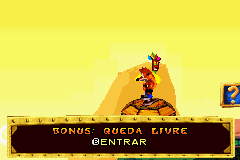

# Crash Bandicoot Fusion

## Informações sobre o jogo

| Tipo | Informação |
| ----------- | ----------- |
| Nome | Crash Bandicoot Fusion |
| Plataforma | [Game Boy Advance](../) |
| Desenvolvedora | Vicarious Visions |
| Distribuidora | Vivendi Games |
| Gênero | Ação / Plataforma |
| Data de Lançamento | 25/06/2004 |

## Informações sobre a tradução

| Tipo | Informação |
| ----------- | ----------- |
| Versão | 1\.0 |
| Última versão | Sim |
| Data de Lançamento | 12/09/2006 |
| Percentual traduzido | None% |

## Autores

| Autor(a) | Papel na tradução |
| ----------- | ----------- |
| [Seven](../../../autores/seven/) | Completo |

## Grupos

* [Tradu\-GameX](../../../grupos/tradu-gamex/)

## Informações sobre patching

| Aplicar o patch no arquivo | CRC32 Hash | MD5 Hash |
| ----------- | ----------- | ----------- |
| Crash Bandicoot Fusion \(E\) \(M5\)\.gba | F24C8E77 | 15E37FB594C2DFE85B8B7BA3B7E565BD |

## Páginas sobre a tradução

| URL | Oficial (publicado pelos autores) | Possuí link de download |
| ----------- | ----------- | ----------- |
| [https://romhackers.org/traducoes/portatil/game-boy-advance/crash-bandicoot-fusion-tradu-gamex/](https://romhackers.org/traducoes/portatil/game-boy-advance/crash-bandicoot-fusion-tradu-gamex/) | Não | Sim |
| [https://www.zophar.net/translations/gameboy-advance/brazilian-portuguese/crash-bandicoot-fusion.html](https://www.zophar.net/translations/gameboy-advance/brazilian-portuguese/crash-bandicoot-fusion.html) | Não | Sim |

## Imagens da tradução

