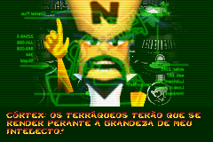
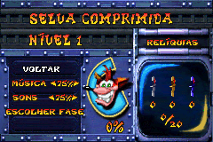

# Crash Bandicoot XS

## Informações sobre o jogo

| Tipo | Informação |
| ----------- | ----------- |
| Nome | Crash Bandicoot XS |
| Plataforma | [Game Boy Advance](../) |
| Desenvolvedora | Vicarious Visions |
| Distribuidora | Universal Interactive |
| Gênero | Ação / Plataforma |
| Data de Lançamento | 15/03/2002 |

## Informações sobre a tradução

| Tipo | Informação |
| ----------- | ----------- |
| Última versão | Sim |
| Data de Lançamento | 28/03/2002 |
| Percentual traduzido | 100% |

## Autores

| Autor(a) | Papel na tradução |
| ----------- | ----------- |
| [S\-NES](../../../autores/s-nes/) | Completo |

## Grupos

* [Tradu\-Roms](../../../grupos/tradu-roms/)

## Informações sobre patching

| Aplicar o patch no arquivo | CRC32 Hash | MD5 Hash |
| ----------- | ----------- | ----------- |
| Crash Bandicoot XS \(E\) \(M6\) \[\!\]\.gba | CCFD654F | B282E479E10AEA057E762DE7B9D4CA4B |

## Páginas sobre a tradução

| URL | Oficial (publicado pelos autores) | Possuí link de download |
| ----------- | ----------- | ----------- |
| [https://traduroms.github.io/tr/tradus/crash.htm](https://traduroms.github.io/tr/tradus/crash.htm) | Sim | Sim |
| [https://romhackers.org/traducoes/portatil/game-boy-advance/crash-bandicoot-xs-tradu-roms/](https://romhackers.org/traducoes/portatil/game-boy-advance/crash-bandicoot-xs-tradu-roms/) | Não | Sim |
| [https://www.zophar.net/translations/gameboy-advance/brazilian-portuguese/crash-bandicoot-xs.html](https://www.zophar.net/translations/gameboy-advance/brazilian-portuguese/crash-bandicoot-xs.html) | Não | Sim |
| [https://joao13traducoes.com/2022/03/gba-crash-bandicoot-xs-tradu-roms/](https://joao13traducoes.com/2022/03/gba-crash-bandicoot-xs-tradu-roms/) | Não | Sim, porém o arquivo ou página de download exige uma senha |

## Imagens da tradução

