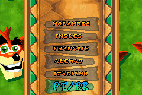
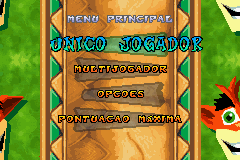
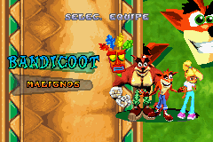
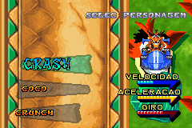
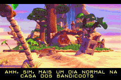
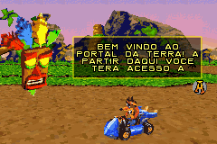
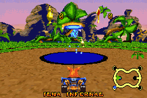
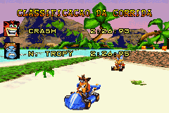

# Crash Nitro Kart

## Informações sobre o jogo

| Tipo | Informação |
| ----------- | ----------- |
| Nome | Crash Nitro Kart |
| Plataforma | [Game Boy Advance](../) |
| Desenvolvedora | Vicarious Visions |
| Distribuidora | Universal Interactive |
| Gênero | Corrida |
| Data de Lançamento | 28/11/2003 |

## Informações sobre a tradução

| Tipo | Informação |
| ----------- | ----------- |
| Versão | 0\.99\.1 |
| Última versão | Sim |
| Data de Lançamento | 24/10/2017 |
| Percentual traduzido | 79% |

## Autores

| Autor(a) | Papel na tradução |
| ----------- | ----------- |
| [ripman](../../../autores/ripman/) | Completo |

## Informações sobre patching

| Aplicar o patch no arquivo | CRC32 Hash | MD5 Hash |
| ----------- | ----------- | ----------- |
| Crash Nitro Kart \(Europe\) \(En,Fr,De,Es,It,Nl\)\.gba | 03925772 | 41832956AB0723CA79D6883C4492FE84 |

## Páginas sobre a tradução

| URL | Oficial (publicado pelos autores) | Possuí link de download |
| ----------- | ----------- | ----------- |
| [https://romhackers.org/traducoes/portatil/game-boy-advance/crash-nitro-kart-ripman/](https://romhackers.org/traducoes/portatil/game-boy-advance/crash-nitro-kart-ripman/) | Não | Sim |

## Imagens da tradução

