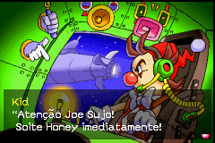
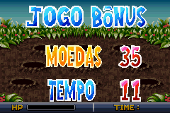

# Crazy Chase

## Informações sobre o jogo

| Tipo | Informação |
| ----------- | ----------- |
| Nome | Crazy Chase |
| Plataforma | [Game Boy Advance](../) |
| Desenvolvedora | Kemco |
| Distribuidora | Kemco |
| Gênero | Ação / Plataforma |
| Data de Lançamento | 23/10/2002 |

## Informações sobre a tradução

| Tipo | Informação |
| ----------- | ----------- |
| Versão | 1\.0 |
| Última versão | Sim |
| Data de Lançamento | 06/10/2012 |
| Percentual traduzido | 98% |

## Autores

| Autor(a) | Papel na tradução |
| ----------- | ----------- |
| [Tiozinho da Telesena](../../../autores/tiozinho-da-telesena/) | Completo |
| [DiegoHH](../../../autores/diegohh/) | Completo |

## Grupos

* [PO\.B\.R\.E](../../../grupos/pobre/)

## Informações sobre patching

| Aplicar o patch no arquivo | CRC32 Hash | MD5 Hash |
| ----------- | ----------- | ----------- |
| Crazy Chase \(U\)\.gba | CABA1DB9 | 44A36F758C4328AA0FFC91EC118CF28D |

## Páginas sobre a tradução

| URL | Oficial (publicado pelos autores) | Possuí link de download |
| ----------- | ----------- | ----------- |
| [https://tiozinhopobre.wixsite.com/repositorio](https://tiozinhopobre.wixsite.com/repositorio) | Sim | Sim |
| [https://romhackers.org/traducoes/portatil/game-boy-advance/crazy-chase-po.b.r.e](https://romhackers.org/traducoes/portatil/game-boy-advance/crazy-chase-po.b.r.e) | Sim | Não |
| [https://www.zophar.net/translations/gameboy-advance/brazilian-portuguese/crazy-chase.html](https://www.zophar.net/translations/gameboy-advance/brazilian-portuguese/crazy-chase.html) | Não | Sim |

## Imagens da tradução

