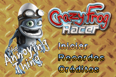
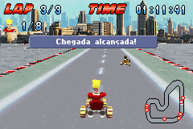
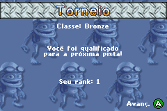

# Crazy Frog Racer

## Informações sobre o jogo

| Tipo | Informação |
| ----------- | ----------- |
| Nome | Crazy Frog Racer |
| Plataforma | [Game Boy Advance](../) |
| Desenvolvedora | Independent Arts Software |
| Distribuidora | DTP Entertainment AG |
| Gênero | Corrida |
| Data de Lançamento | 16/12/2005 |

## Informações sobre a tradução

| Tipo | Informação |
| ----------- | ----------- |
| Última versão | Sim |
| Data de Lançamento | 14/01/2006 |
| Percentual traduzido | None% |

## Autores

| Autor(a) | Papel na tradução |
| ----------- | ----------- |
| [Dr\. X](../../../autores/dr-x/) | Completo |

## Grupos

* [Made In Brasil \(MIB\)](../../../grupos/made-in-brasil-mib/)

## Informações sobre patching

| Aplicar o patch no arquivo | CRC32 Hash | MD5 Hash |
| ----------- | ----------- | ----------- |
| Crazy Frog Racer \(E\) \(M4\)\.gba | 2723236B | F341BAB11F2BFD79B995554D40A61CBA |

## Páginas sobre a tradução

| URL | Oficial (publicado pelos autores) | Possuí link de download |
| ----------- | ----------- | ----------- |
| [https://romhackers.org/traducoes/portatil/game-boy-advance/crazy-frog-racer-central-mib/](https://romhackers.org/traducoes/portatil/game-boy-advance/crazy-frog-racer-central-mib/) | Não | Sim |
| [https://www.zophar.net/translations/gameboy-advance/brazilian-portuguese/crazy-frog-racer.html](https://www.zophar.net/translations/gameboy-advance/brazilian-portuguese/crazy-frog-racer.html) | Não | Sim |
| [https://joao13traducoes.com/2022/03/gba-crazy-frog-racer-central-mib/](https://joao13traducoes.com/2022/03/gba-crazy-frog-racer-central-mib/) | Não | Sim, porém o arquivo ou página de download exige uma senha |

## Imagens da tradução

