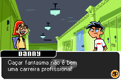
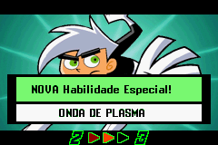

# Danny Phantom - The Ultimate Enemy

## Informações sobre o jogo

| Tipo | Informação |
| ----------- | ----------- |
| Nome | Danny Phantom \- The Ultimate Enemy |
| Plataforma | [Game Boy Advance](../) |
| Desenvolvedora | Altron |
| Distribuidora | THQ |
| Gênero | Beat 'em up |
| Data de Lançamento | 26/05/2006 |

## Informações sobre a tradução

| Tipo | Informação |
| ----------- | ----------- |
| Versão | 1\.0 |
| Última versão | Sim |
| Data de Lançamento | 21/08/2007 |
| Percentual traduzido | None% |

## Autores

| Autor(a) | Papel na tradução |
| ----------- | ----------- |
| [Seven](../../../autores/seven/) | Completo |

## Grupos

* [Tradu\-GameX](../../../grupos/tradu-gamex/)

## Informações sobre patching

| Aplicar o patch no arquivo | CRC32 Hash | MD5 Hash |
| ----------- | ----------- | ----------- |
| Danny Phantom \- The Ultimate Enemy \(E\) \(M3\)\.gba | E1DE905F | 8FA0CA30575846480A1BBA06DCFD6508 |

## Páginas sobre a tradução

| URL | Oficial (publicado pelos autores) | Possuí link de download |
| ----------- | ----------- | ----------- |
| [https://romhackers.org/traducoes/portatil/game-boy-advance/danny-phantom-the-ultimate-enemy-tradu-gamex/](https://romhackers.org/traducoes/portatil/game-boy-advance/danny-phantom-the-ultimate-enemy-tradu-gamex/) | Não | Sim |
| [https://www.zophar.net/translations/gameboy-advance/brazilian-portuguese/danny-phantom-the-ultimate-enemy.html](https://www.zophar.net/translations/gameboy-advance/brazilian-portuguese/danny-phantom-the-ultimate-enemy.html) | Não | Sim |
| [https://joao13traducoes.com/2022/03/gba-danny-phantom-the-ultimate-enemy-tradu-gamex/](https://joao13traducoes.com/2022/03/gba-danny-phantom-the-ultimate-enemy-tradu-gamex/) | Não | Sim, porém o arquivo ou página de download exige uma senha |

## Imagens da tradução

