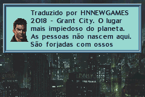
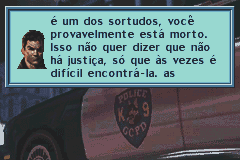
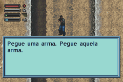
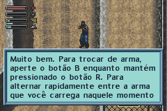
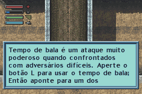

# Dead to Rights

## Informações sobre o jogo

| Tipo | Informação |
| ----------- | ----------- |
| Nome | Dead to Rights |
| Plataforma | [Game Boy Advance](../) |
| Desenvolvedora | Torus Games |
| Distribuidora | NAMCO |
| Gênero | Ação |
| Data de Lançamento | 26/11/2004 |

## Informações sobre a tradução

| Tipo | Informação |
| ----------- | ----------- |
| Versão | 1\.0 |
| Última versão | Sim |
| URL Youtube | https://www.youtube.com/watch?v=sDSKw8YFjLg |
| Data de Lançamento | 28/02/2018 |
| Percentual traduzido | 80% |

## Autores

| Autor(a) | Papel na tradução |
| ----------- | ----------- |
| [hnnewgames](../../../autores/hnnewgames/) | Completo |

## Informações sobre patching

| Formato do patch | Aplicar o patch no arquivo | CRC32 Hash | MD5 Hash |
| ----------- | ----------- | ----------- | ----------- |
| IPS e Xdelta | Dead to Rights \(E\) \(M5\) | 2994DE1D | 01356207595154E92EFA8B97B6E48ACD |

## Páginas sobre a tradução

| URL | Oficial (publicado pelos autores) | Possuí link de download |
| ----------- | ----------- | ----------- |
| [https://www.romhacking.net.br/index.php?topic=535](https://www.romhacking.net.br/index.php?topic=535) | Sim | Sim |
| [https://hnnewgamesofficial.blogspot.com/2018/02/dead-to-rights-portugues-gba.html](https://hnnewgamesofficial.blogspot.com/2018/02/dead-to-rights-portugues-gba.html) | Sim | Sim |
| [https://romhackers.org/traducoes/portatil/game-boy-advance/dead-to-rights-hnnewgames/](https://romhackers.org/traducoes/portatil/game-boy-advance/dead-to-rights-hnnewgames/) | Não | Não |
| [https://joao13traducoes.com/2018/02/gba-dead-to-rights-hnnewgames/](https://joao13traducoes.com/2018/02/gba-dead-to-rights-hnnewgames/) | Não | Sim, porém o arquivo ou página de download exige uma senha |

## Imagens da tradução

