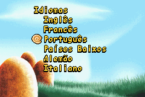
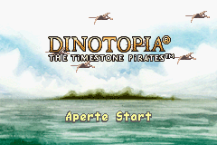
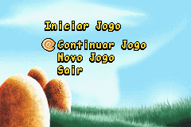
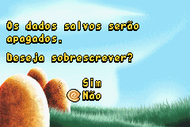
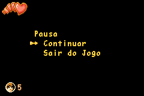
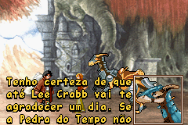

# Dinotopia - The Timestone Pirates

## Informações sobre o jogo

| Tipo | Informação |
| ----------- | ----------- |
| Nome | Dinotopia \- The Timestone Pirates |
| Plataforma | [Game Boy Advance](../) |
| Desenvolvedora | RFX Interactive |
| Distribuidora | TDK Mediactive |
| Gênero | Ação / Plataforma |
| Data de Lançamento | 30/04/2002 |

## Informações sobre a tradução

| Tipo | Informação |
| ----------- | ----------- |
| Versão | 1\.16 |
| Última versão | Sim |
| Observação | A telas copyright,créditos, game over e título não foram traduzidas pois são compartilhadas por todos idiomas do jogo\. |
| Data de Lançamento | 16/02/2019 |
| Percentual traduzido | 90% |

## Autores

| Autor(a) | Papel na tradução |
| ----------- | ----------- |
| [Antígeno](../../../autores/antigeno/) | Completo |

## Informações sobre patching

| Aplicar o patch no arquivo | CRC32 Hash | MD5 Hash |
| ----------- | ----------- | ----------- |
| Dinotopia \- The Timestone Pirates \(UE\) \(M6\)\.gba | 7BD01B31 | BAB43E61606514080129A179E931B2B6 |

## Páginas sobre a tradução

| URL | Oficial (publicado pelos autores) | Possuí link de download |
| ----------- | ----------- | ----------- |
| [https://www.romhacking.net.br/index.php?topic=1003](https://www.romhacking.net.br/index.php?topic=1003) | Sim | Sim, porém é necessário realizar login |
| [https://blogdoantigeno.wordpress.com/traducoes/](https://blogdoantigeno.wordpress.com/traducoes/) | Sim | Sim, porém é necessário realizar login |
| [https://joao13traducoes.com/2019/02/gba-dinotopia-timestone-pirates-antigeno/](https://joao13traducoes.com/2019/02/gba-dinotopia-timestone-pirates-antigeno/) | Não | Sim, porém o arquivo ou página de download exige uma senha |

## Imagens da tradução

