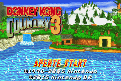
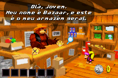
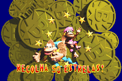

# Donkey Kong Country 3

## Informações sobre o jogo

| Tipo | Informação |
| ----------- | ----------- |
| Nome | Donkey Kong Country 3 |
| Plataforma | [Game Boy Advance](../) |
| Desenvolvedora | Rare |
| Distribuidora | Nintendo |
| Gênero | Ação / Plataforma |
| Data de Lançamento | 04/11/2005 |

## Informações sobre a tradução

| Tipo | Informação |
| ----------- | ----------- |
| Versão | 1\.0 |
| Última versão | Sim |
| Data de Lançamento | 13/06/2015 |
| Percentual traduzido | 90% |

## Autores

| Autor(a) | Papel na tradução |
| ----------- | ----------- |
| [Kamppello](../../../autores/kamppello/) | Completo |

## Grupos

* [Nintendo BR](../../../grupos/nintendo-br/)

## Informações sobre patching

| Aplicar o patch no arquivo | CRC32 Hash | MD5 Hash |
| ----------- | ----------- | ----------- |
| Donkey Kong Country 3 \(E\)\.gba | 708A6168 | D7F41D490BCB72F0711B070DE85A8C8B |

## Páginas sobre a tradução

| URL | Oficial (publicado pelos autores) | Possuí link de download |
| ----------- | ----------- | ----------- |
| [https://nbr-traducoes.blogspot.com/2015/06/traducao-do-donkey-kong-country-3.html](https://nbr-traducoes.blogspot.com/2015/06/traducao-do-donkey-kong-country-3.html) | Sim | Não |
| [https://romhackers.org/traducoes/portatil/game-boy-advance/donkey-kong-country-3-nintendo-br/](https://romhackers.org/traducoes/portatil/game-boy-advance/donkey-kong-country-3-nintendo-br/) | Não | Sim |

## Imagens da tradução

