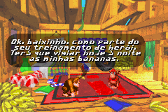

# Donkey Kong Country

## Informações sobre o jogo

| Tipo | Informação |
| ----------- | ----------- |
| Nome | Donkey Kong Country |
| Plataforma | [Game Boy Advance](../) |
| Desenvolvedora | Rare |
| Distribuidora | Nintendo |
| Gênero | Ação / Plataforma |
| Data de Lançamento | 09/06/2003 |

## Informações sobre a tradução

| Tipo | Informação |
| ----------- | ----------- |
| Versão | BETA |
| Última versão | Sim |
| Data de Lançamento | 10/03/2011 |
| Percentual traduzido | 90% |

## Autores

| Autor(a) | Papel na tradução |
| ----------- | ----------- |
| [Kratos\-AM](../../../autores/kratos-am/) | Completo |

## Informações sobre patching

| Aplicar o patch no arquivo | CRC32 Hash | MD5 Hash |
| ----------- | ----------- | ----------- |
| Donkey Kong Country \(U\) \[\!\]\.gba | 12F7A968 | B3806462180CDA73D1F8F48D72236394 |

## Páginas sobre a tradução

| URL | Oficial (publicado pelos autores) | Possuí link de download |
| ----------- | ----------- | ----------- |
| [https://romhackers.org/traducoes/portatil/game-boy-advance/donkey-kong-country-kratos-am/](https://romhackers.org/traducoes/portatil/game-boy-advance/donkey-kong-country-kratos-am/) | Não | Sim |

## Imagens da tradução

