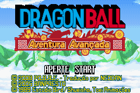

# Dragon Ball - Advanced Adventure

## Informações sobre o jogo

| Tipo | Informação |
| ----------- | ----------- |
| Nome | Dragon Ball \- Advanced Adventure |
| Plataforma | [Game Boy Advance](../) |
| Desenvolvedora | Dimps |
| Distribuidora | Bandai |
| Gênero | Beat 'em up |
| Data de Lançamento | 17/06/2005 |

## Informações sobre a tradução

| Tipo | Informação |
| ----------- | ----------- |
| Versão | 1\.1 |
| Última versão | Sim |
| Data de Lançamento | 25/12/2008 |
| Percentual traduzido | 99% |

## Autores

| Autor(a) | Papel na tradução |
| ----------- | ----------- |
| [NEODAN](../../../autores/neodan/) | Completo |
| [Devilfox](../../../autores/devilfox/) | Tradução |
| [gamer\_boy](../../../autores/gamer_boy/) | Tradução |
| [Simon](../../../autores/simon/) | Tradução |
| [tvtoon](../../../autores/tvtoon/) | Tradução |
| [Tiozinho da Telesena](../../../autores/tiozinho-da-telesena/) | Tradução |

## Grupos

* [PO\.B\.R\.E](../../../grupos/pobre/)

## Informações sobre patching

| Aplicar o patch no arquivo | CRC32 Hash | MD5 Hash |
| ----------- | ----------- | ----------- |
| Dragon Ball \- Advanced Adventure \(Europe\) \(En,Fr,De,Es,It\)\.gba | 6C135820 | CB14DF09EA41694532A9327510BB28C1 |

## Páginas sobre a tradução

| URL | Oficial (publicado pelos autores) | Possuí link de download |
| ----------- | ----------- | ----------- |
| [https://romhackers.org/traducoes/portatil/game-boy-advance/dragon-ball-advanced-adventure-po.b.r.e](https://romhackers.org/traducoes/portatil/game-boy-advance/dragon-ball-advanced-adventure-po.b.r.e) | Sim | Sim |
| [https://www.zophar.net/translations/gameboy-advance/brazilian-portuguese/dragon-ball-advanced-adventure.html](https://www.zophar.net/translations/gameboy-advance/brazilian-portuguese/dragon-ball-advanced-adventure.html) | Não | Sim |

## Imagens da tradução

