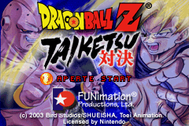
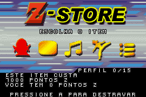
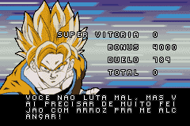

# Dragon Ball Z - Taiketsu

## Informações sobre o jogo

| Tipo | Informação |
| ----------- | ----------- |
| Nome | Dragon Ball Z \- Taiketsu |
| Plataforma | [Game Boy Advance](../) |
| Desenvolvedora | Webfoot Technologies |
| Distribuidora | Atari |
| Gênero | Luta |
| Data de Lançamento | 26/03/2004 |

## Informações sobre a tradução

| Tipo | Informação |
| ----------- | ----------- |
| Versão | 0\.95 |
| Última versão | Sim |
| Data de Lançamento | (Provavelmente) 08/05/2005 |
| Percentual traduzido | None% |

## Autores

| Autor(a) | Papel na tradução |
| ----------- | ----------- |
| [Orochistyle](../../../autores/orochistyle/) | Completo |

## Grupos

* [TransFac](../../../grupos/transfac/)

## Informações sobre patching

| Aplicar o patch no arquivo | CRC32 Hash | MD5 Hash |
| ----------- | ----------- | ----------- |
| Dragon Ball Z \- Taiketsu \(E\) \(M5\)\.gba | D0E79665 | 0FD6897002244985CAB200501E1B48C9 |

## Páginas sobre a tradução

| URL | Oficial (publicado pelos autores) | Possuí link de download |
| ----------- | ----------- | ----------- |
| [https://romhackers.org/traducoes/portatil/game-boy-advance/dragon-ball-z-taiketsu-transfac/](https://romhackers.org/traducoes/portatil/game-boy-advance/dragon-ball-z-taiketsu-transfac/) | Não | Sim |
| [https://www.zophar.net/translations/gameboy-advance/brazilian-portuguese/dragon-ball-z-taiketsu.html](https://www.zophar.net/translations/gameboy-advance/brazilian-portuguese/dragon-ball-z-taiketsu.html) | Não | Sim |

## Imagens da tradução

