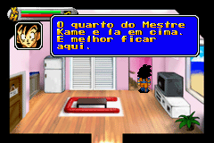

# Dragon Ball Z - The Legacy of Goku

## Informações sobre o jogo

| Tipo | Informação |
| ----------- | ----------- |
| Nome | Dragon Ball Z \- The Legacy of Goku |
| Plataforma | [Game Boy Advance](../) |
| Desenvolvedora | Webfoot Technologies |
| Distribuidora | Infogrames |
| Gênero | RPG / Ação |
| Data de Lançamento | 14/05/2002 |

## Informações sobre a tradução

| Tipo | Informação |
| ----------- | ----------- |
| Versão | 1\.2 |
| Última versão | Sim |
| Data de Lançamento | 30/06/2002 |
| Percentual traduzido | 100% |

## Autores

| Autor(a) | Papel na tradução |
| ----------- | ----------- |
| [Fserve](../../../autores/fserve/) | Completo |
| [Groxo\_](../../../autores/groxo/) | Tradução |

## Grupos

* [Tradu\-Roms](../../../grupos/tradu-roms/)

## Informações sobre patching

| Aplicar o patch no arquivo | CRC32 Hash | MD5 Hash |
| ----------- | ----------- | ----------- |
| Dragon Ball Z \- The Legacy of Goku \(U\) \[hI\]\.gba | 3DE06A92 | 2AE646903C660FBC16E6FB7F52F5860F |
| Dragon Ball Z \- The Legacy of Goku \(U\) \[\!\]\.gba | D47CCFF4 | 3100FC5A4427A7B0CC20B861134E60F2 |

## Páginas sobre a tradução

| URL | Oficial (publicado pelos autores) | Possuí link de download |
| ----------- | ----------- | ----------- |
| [https://traduroms.github.io/tr/tradus/dbzlog.htm](https://traduroms.github.io/tr/tradus/dbzlog.htm) | Sim | Sim |
| [https://romhackers.org/traducoes/portatil/game-boy-advance/dragon-ball-z-the-legacy-of-goku-tradu-roms/](https://romhackers.org/traducoes/portatil/game-boy-advance/dragon-ball-z-the-legacy-of-goku-tradu-roms/) | Não | Sim |
| [https://www.zophar.net/translations/gameboy-advance/brazilian-portuguese/dragon-ball-z-the-legacy-of-goku.html](https://www.zophar.net/translations/gameboy-advance/brazilian-portuguese/dragon-ball-z-the-legacy-of-goku.html) | Não | Sim |

## Imagens da tradução

