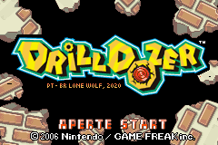
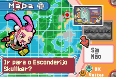
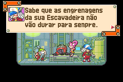
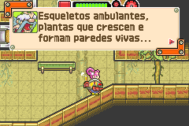

# Drill Dozer

## Informações sobre o jogo

| Tipo | Informação |
| ----------- | ----------- |
| Nome | Drill Dozer |
| Plataforma | [Game Boy Advance](../) |
| Desenvolvedora | Game Freak |
| Distribuidora | Nintendo |
| Gênero | Ação / Plataforma |
| Data de Lançamento | 06/02/2006 |

## Informações sobre a tradução

| Tipo | Informação |
| ----------- | ----------- |
| Versão | 1\.8 |
| Última versão | Sim |
| Data de Lançamento | 09/10/2020 |
| Percentual traduzido | 99% |

## Autores

| Autor(a) | Papel na tradução |
| ----------- | ----------- |
| [Lone Wolf](../../../autores/lone-wolf/) | Completo |

## Informações sobre patching

| Aplicar o patch no arquivo | CRC32 Hash | MD5 Hash |
| ----------- | ----------- | ----------- |
| Drill Dozer \(U\)\.gba | E60EC183 | 14DAB12E795098988D46B96885170538 |

## Páginas sobre a tradução

| URL | Oficial (publicado pelos autores) | Possuí link de download |
| ----------- | ----------- | ----------- |
| [https://www.romhacking.net.br/index.php?topic=1500](https://www.romhacking.net.br/index.php?topic=1500) | Sim | Sim |
| [https://www.romhacking.net/translations/5560/](https://www.romhacking.net/translations/5560/) | Não | Sim |
| [https://joao13traducoes.com/2020/06/gba-drill-dozer-lone-wolf/](https://joao13traducoes.com/2020/06/gba-drill-dozer-lone-wolf/) | Não | Sim, porém o arquivo ou página de download exige uma senha |

## Imagens da tradução

