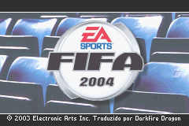
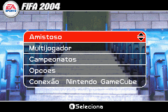
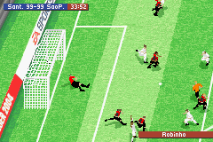

# FIFA 2004

## Informações sobre o jogo

| Tipo | Informação |
| ----------- | ----------- |
| Nome | FIFA 2004 |
| Plataforma | [Game Boy Advance](../) |
| Desenvolvedora | Exient |
| Distribuidora | Electronic Arts (EA) |
| Gênero | Esportes |
| Data de Lançamento | 04/11/2003 |

## Informações sobre a tradução

| Tipo | Informação |
| ----------- | ----------- |
| Última versão | Sim |
| Data de Lançamento | (Provavelmente) 02/08/2005 |
| Percentual traduzido | None% |

## Autores

| Autor(a) | Papel na tradução |
| ----------- | ----------- |
| [Darkfire Dragon](../../../autores/darkfire-dragon/) | Completo |

## Informações sobre patching

| Aplicar o patch no arquivo | CRC32 Hash | MD5 Hash |
| ----------- | ----------- | ----------- |
| FIFA Football 2004 \(UE\) \(M6\)\.gba | 1ABBC24F | F9E6BFC9404BE783B149259FFD9C5DA0 |

## Páginas sobre a tradução

| URL | Oficial (publicado pelos autores) | Possuí link de download |
| ----------- | ----------- | ----------- |
| [https://romhackers.org/traducoes/portatil/game-boy-advance/fifa-2004-darkfire-dragon/](https://romhackers.org/traducoes/portatil/game-boy-advance/fifa-2004-darkfire-dragon/) | Não | Sim |
| [https://www.zophar.net/translations/gameboy-advance/brazilian-portuguese/fifa-2004.html](https://www.zophar.net/translations/gameboy-advance/brazilian-portuguese/fifa-2004.html) | Não | Sim |

## Imagens da tradução

