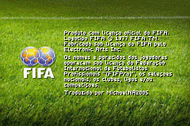
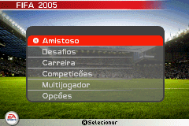
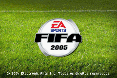
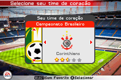
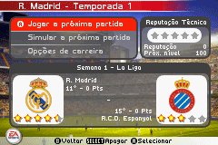
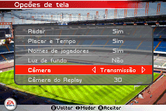
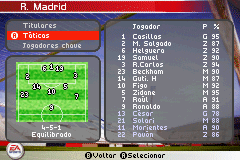
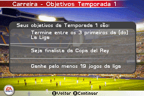
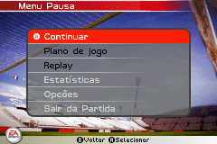

# FIFA 2005

## Informações sobre o jogo

| Tipo | Informação |
| ----------- | ----------- |
| Nome | FIFA 2005 |
| Plataforma | [Game Boy Advance](../) |
| Desenvolvedora | Exient |
| Distribuidora | Electronic Arts (EA) |
| Gênero | Esportes |
| Data de Lançamento | 08/10/2004 |

## Informações sobre a tradução

| Tipo | Informação |
| ----------- | ----------- |
| Versão | 1\.1 |
| Última versão | Sim |
| Data de Lançamento | 21/06/2021 |
| Percentual traduzido | 80% |

## Autores

| Autor(a) | Papel na tradução |
| ----------- | ----------- |
| [MichaelNA2005](../../../autores/michaelna2005/) | Completo |

## Informações sobre patching

| Aplicar o patch no arquivo | CRC32 Hash | MD5 Hash |
| ----------- | ----------- | ----------- |
| FIFA Football 2005 \(UE\) \(M6\) | DA90F396 | 4C5C302D02ECFCD274DAE63461A1692B |

## Páginas sobre a tradução

| URL | Oficial (publicado pelos autores) | Possuí link de download |
| ----------- | ----------- | ----------- |
| [https://www.romhacking.net.br/index.php?topic=1893](https://www.romhacking.net.br/index.php?topic=1893) | Sim | Sim |
| [https://www.romhacking.net/translations/6134/](https://www.romhacking.net/translations/6134/) | Não | Sim |
| [https://joao13traducoes.com/2021/06/gba-fifa-2005-michaelna2005/](https://joao13traducoes.com/2021/06/gba-fifa-2005-michaelna2005/) | Não | Sim, porém o arquivo ou página de download exige uma senha |

## Imagens da tradução

