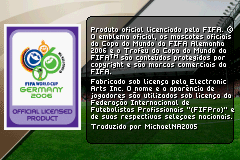
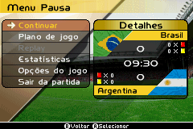
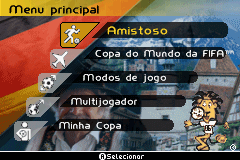
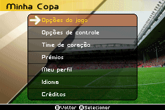
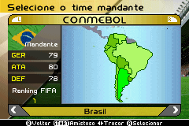
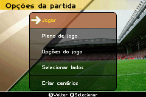
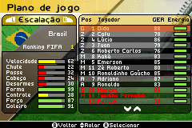
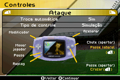
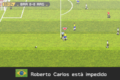

# FIFA World Cup - Germany 2006

## Informações sobre o jogo

| Tipo | Informação |
| ----------- | ----------- |
| Nome | FIFA World Cup \- Germany 2006 |
| Plataforma | [Game Boy Advance](../) |
| Desenvolvedora | Exient |
| Distribuidora | Electronic Arts (EA) |
| Gênero | Esportes |
| Data de Lançamento | 24/04/2006 |

## Informações sobre a tradução

| Tipo | Informação |
| ----------- | ----------- |
| Versão | 1\.0 |
| Última versão | Sim |
| Data de Lançamento | 01/07/2022 |
| Percentual traduzido | 100% |

## Autores

| Autor(a) | Papel na tradução |
| ----------- | ----------- |
| [MichaelNA2005](../../../autores/michaelna2005/) | Completo |

## Informações sobre patching

| Aplicar o patch no arquivo | CRC32 Hash | MD5 Hash |
| ----------- | ----------- | ----------- |
| FIFA World Cup Germany 2006 \(UE\) \(M5\)\.gba | 50AB4544 | BB87013EC30BEBF3DD7CB07AB6786262 |

## Páginas sobre a tradução

| URL | Oficial (publicado pelos autores) | Possuí link de download |
| ----------- | ----------- | ----------- |
| [https://www.romhacking.net.br/index.php?topic=2146](https://www.romhacking.net.br/index.php?topic=2146) | Sim | Sim, porém é necessário realizar login |
| [https://www.romhacking.net/translations/6597/](https://www.romhacking.net/translations/6597/) | Não | Sim |
| [https://joao13traducoes.com/2022/07/gba-fifa-world-cup-germany-2006-michaelna2005/](https://joao13traducoes.com/2022/07/gba-fifa-world-cup-germany-2006-michaelna2005/) | Não | Sim, porém o arquivo ou página de download exige uma senha |

## Imagens da tradução

