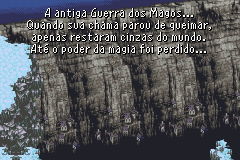
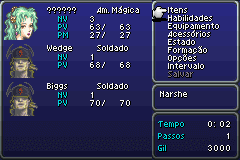

# Final Fantasy VI Advance

## Informações sobre o jogo

| Tipo | Informação |
| ----------- | ----------- |
| Nome | Final Fantasy VI Advance |
| Plataforma | [Game Boy Advance](../) |
| Desenvolvedora | Squaresoft |
| Distribuidora | Nintendo |
| Gênero | RPG / Turno |
| Data de Lançamento | (Por volta de) ??/??/2007 |

## Informações sobre a tradução

| Tipo | Informação |
| ----------- | ----------- |
| Versão | 1\.0 |
| Última versão | Sim |
| Data de Lançamento | 28/02/2011 |
| Percentual traduzido | 100% |

## Autores

| Autor(a) | Papel na tradução |
| ----------- | ----------- |
| [tvtoon](../../../autores/tvtoon/) | Completo |
| [Joapeer](../../../autores/joapeer/) | Completo |
| [Dark Fou\-Lu](../../../autores/dark-fou-lu/) | Tradução |
| [Ilune](../../../autores/ilune/) | Tradução |
| [RyuuRanX](../../../autores/ryuuranx/) | Tradução |
| [Solid\_One](../../../autores/solid_one/) | Tradução |
| [TED](../../../autores/ted/) | Tradução |

## Grupos

* [PO\.B\.R\.E](../../../grupos/pobre/)

## Informações sobre patching

| Aplicar o patch no arquivo | CRC32 Hash | MD5 Hash |
| ----------- | ----------- | ----------- |
| Final Fantasy VI Advance \(U\)\.gba | D708F5AB | D1C3D1798A3F347FBAB41F151C99DECE |

## Páginas sobre a tradução

| URL | Oficial (publicado pelos autores) | Possuí link de download |
| ----------- | ----------- | ----------- |
| [https://romhackers.org/traducoes/portatil/game-boy-advance/final-fantasy-vi-advance-po.b.r.e](https://romhackers.org/traducoes/portatil/game-boy-advance/final-fantasy-vi-advance-po.b.r.e) | Sim | Sim |
| [https://www.zophar.net/translations/gameboy-advance/brazilian-portuguese/final-fantasy-vi-advance.html](https://www.zophar.net/translations/gameboy-advance/brazilian-portuguese/final-fantasy-vi-advance.html) | Não | Sim |

## Imagens da tradução

