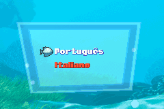
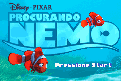
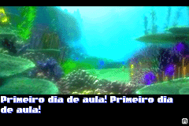

# Finding Nemo

## Informações sobre o jogo

| Tipo | Informação |
| ----------- | ----------- |
| Nome | Finding Nemo |
| Plataforma | [Game Boy Advance](../) |
| Desenvolvedora | Vicarious Visions |
| Distribuidora | THQ |
| Gênero | Ação / Plataforma |
| Data de Lançamento | 12/05/2003 |

## Informações sobre a tradução

| Tipo | Informação |
| ----------- | ----------- |
| Versão | 1\.0 |
| Última versão | Sim |
| URL Youtube | https://youtu.be/g7bSURlaWUA |
| Data de Lançamento | 04/04/2021 |
| Percentual traduzido | 99% |

## Autores

| Autor(a) | Papel na tradução |
| ----------- | ----------- |
| [Breno](../../../autores/breno/) | Completo |
| [Denim](../../../autores/denim/) | Romhacking |

## Informações sobre patching

| Aplicar o patch no arquivo | CRC32 Hash | MD5 Hash |
| ----------- | ----------- | ----------- |
| Finding Nemo \(Europe\) \(Es,It\)\.gba | 3E6F4F03 | B7A094F8568555602158DCEE3750179F |

## Páginas sobre a tradução

| URL | Oficial (publicado pelos autores) | Possuí link de download |
| ----------- | ----------- | ----------- |
| [https://www.romhacking.net.br/index.php?topic=1826](https://www.romhacking.net.br/index.php?topic=1826) | Sim | Sim, porém é necessário realizar login |
| [https://joao13traducoes.com/2021/05/gba-finding-nemo-breno-e-denim/](https://joao13traducoes.com/2021/05/gba-finding-nemo-breno-e-denim/) | Não | Sim, porém o arquivo ou página de download exige uma senha |

## Imagens da tradução

