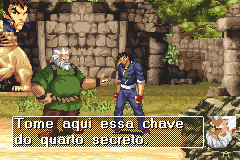

# Gekido Advance - Kintaro's Revenge

## Informações sobre o jogo

| Tipo | Informação |
| ----------- | ----------- |
| Nome | Gekido Advance \- Kintaro's Revenge |
| Plataforma | [Game Boy Advance](../) |
| Desenvolvedora | NAPS Team |
| Distribuidora | Destination Software (DSI Games) |
| Gênero | Beat 'em up |
| Data de Lançamento | 18/11/2003 |

## Informações sobre a tradução

| Tipo | Informação |
| ----------- | ----------- |
| Última versão | Sim |
| Observação | Aplicar o IPS na rom americana no lugar da européia\. |
| Data de Lançamento | 24/09/2007 |
| Percentual traduzido | 80% |

## Autores

| Autor(a) | Papel na tradução |
| ----------- | ----------- |
| [Monge Crono](../../../autores/monge-crono/) | Completo |

## Grupos

* [Central de Traduções](../../../grupos/central-de-traducoes/)

## Informações sobre patching

| Aplicar o patch no arquivo | CRC32 Hash | MD5 Hash |
| ----------- | ----------- | ----------- |
| Gekido Advance \- Kintaro’s Revenge \(U\)\.gba | 6BBC5F4D | F58A7E485676F66C1C88126675D57EFF |

## Páginas sobre a tradução

| URL | Oficial (publicado pelos autores) | Possuí link de download |
| ----------- | ----------- | ----------- |
| [https://romhackers.org/traducoes/portatil/game-boy-advance/gekido-advance-kintaros-revenge-central-de-traducoes/](https://romhackers.org/traducoes/portatil/game-boy-advance/gekido-advance-kintaros-revenge-central-de-traducoes/) | Não | Sim |
| [https://www.zophar.net/translations/gameboy-advance/brazilian-portuguese/gekido-advance-kintaro-s-revenge.html](https://www.zophar.net/translations/gameboy-advance/brazilian-portuguese/gekido-advance-kintaro-s-revenge.html) | Não | Sim |

## Imagens da tradução

