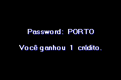
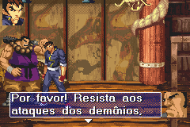

# Gekido Advance - Kintaro's Revenge

## Informações sobre o jogo

| Tipo | Informação |
| ----------- | ----------- |
| Nome | Gekido Advance \- Kintaro's Revenge |
| Plataforma | [Game Boy Advance](../) |
| Desenvolvedora | NAPS Team |
| Distribuidora | Destination Software (DSI Games) |
| Gênero | Beat 'em up |
| Data de Lançamento | 18/11/2003 |

## Informações sobre a tradução

| Tipo | Informação |
| ----------- | ----------- |
| Versão | 1\.1 |
| Última versão | Sim |
| Data de Lançamento | (Provavelmente) 29/01/2004 |
| Percentual traduzido | 100% |

## Autores

| Autor(a) | Papel na tradução |
| ----------- | ----------- |
| [Ninho](../../../autores/ninho/) | Completo |
| [Gambas](../../../autores/gambas/) | Completo |
| [Japa Boy Junior](../../../autores/japa-boy-junior/) | Revisão |

## Grupos

* [Trans\-Center](../../../grupos/trans-center/)

## Informações sobre patching

| Aplicar o patch no arquivo | CRC32 Hash | MD5 Hash |
| ----------- | ----------- | ----------- |
| Gekido Advance \- Kintaro’s Revenge \(U\)\.gba | 6BBC5F4D | F58A7E485676F66C1C88126675D57EFF |

## Páginas sobre a tradução

| URL | Oficial (publicado pelos autores) | Possuí link de download |
| ----------- | ----------- | ----------- |
| [https://romhackers.org/traducoes/portatil/game-boy-advance/gekido-advance-kintaros-revenge-trans-center/](https://romhackers.org/traducoes/portatil/game-boy-advance/gekido-advance-kintaros-revenge-trans-center/) | Não | Sim |
| [https://www.zophar.net/translations/gameboy-advance/brazilian-portuguese/gekido-advance-kintaro-s-revenge-cur.html](https://www.zophar.net/translations/gameboy-advance/brazilian-portuguese/gekido-advance-kintaro-s-revenge-cur.html) | Não | Sim |

## Imagens da tradução

