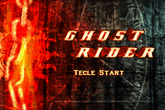
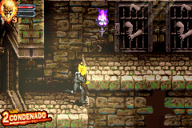

# Ghost Rider

## Informações sobre o jogo

| Tipo | Informação |
| ----------- | ----------- |
| Nome | Ghost Rider |
| Plataforma | [Game Boy Advance](../) |
| Desenvolvedora | Magic Pockets |
| Distribuidora | 2K Games |
| Gênero | Beat 'em up |
| Data de Lançamento | 13/02/2007 |

## Informações sobre a tradução

| Tipo | Informação |
| ----------- | ----------- |
| Última versão | Sim |
| Data de Lançamento | 26/02/2007 |
| Percentual traduzido | None% |

## Autores

| Autor(a) | Papel na tradução |
| ----------- | ----------- |
| [Vyktor Gaiden](../../../autores/vyktor-gaiden/) | Completo |

## Informações sobre patching

| Aplicar o patch no arquivo | CRC32 Hash | MD5 Hash |
| ----------- | ----------- | ----------- |
| Ghost Rider \(U\) \(M6\) \[\!\]\.gba | CF190F2E | D6E41A11CFD0FA428BC43A68B5AF7BCA |

## Páginas sobre a tradução

| URL | Oficial (publicado pelos autores) | Possuí link de download |
| ----------- | ----------- | ----------- |
| [https://romhackers.org/traducoes/portatil/game-boy-advance/ghost-rider-vyktor-gaiden/](https://romhackers.org/traducoes/portatil/game-boy-advance/ghost-rider-vyktor-gaiden/) | Não | Sim |
| [https://www.zophar.net/translations/gameboy-advance/brazilian-portuguese/ghost-rider.html](https://www.zophar.net/translations/gameboy-advance/brazilian-portuguese/ghost-rider.html) | Não | Sim |

## Imagens da tradução

