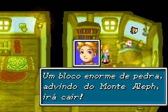
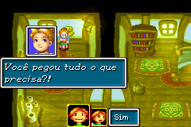
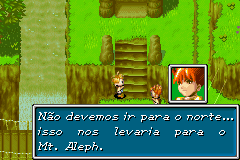
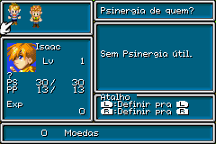
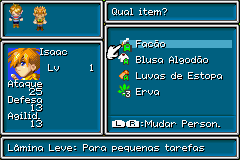
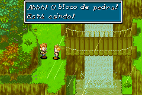

# Golden Sun

## Informações sobre o jogo

| Tipo | Informação |
| ----------- | ----------- |
| Nome | Golden Sun |
| Plataforma | [Game Boy Advance](../) |
| Desenvolvedora | Camelot |
| Distribuidora | Nintendo |
| Gênero | RPG / Turno |
| Data de Lançamento | 11/11/2001 |

## Informações sobre a tradução

| Tipo | Informação |
| ----------- | ----------- |
| Versão | Beta9 |
| Última versão | Sim |
| Data de Lançamento | (Por volta de) ??/03/2010 |
| Percentual traduzido | 99% |

## Autores

| Autor(a) | Papel na tradução |
| ----------- | ----------- |
| [Kyle The Runner](../../../autores/kyle-the-runner/) | Completo |

## Informações sobre patching

| Aplicar o patch no arquivo | CRC32 Hash | MD5 Hash |
| ----------- | ----------- | ----------- |
| Golden Sun \(I\) \[\!\]\.gba | F3128812 | 3210F30E13B7BF65D4E5AB42235AD663 |

## Páginas sobre a tradução

| URL | Oficial (publicado pelos autores) | Possuí link de download |
| ----------- | ----------- | ----------- |
| [https://romhackers.org/traducoes/portatil/game-boy-advance/golden-sun-versao-italiana-kyle-the-runner/](https://romhackers.org/traducoes/portatil/game-boy-advance/golden-sun-versao-italiana-kyle-the-runner/) | Não | Sim |
| [https://www.zophar.net/translations/gameboy-advance/brazilian-portuguese/golden-sun-bzu.html](https://www.zophar.net/translations/gameboy-advance/brazilian-portuguese/golden-sun-bzu.html) | Não | Sim |

## Imagens da tradução

