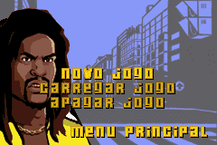
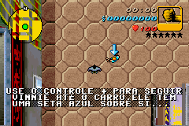
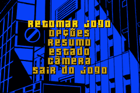

# Grand Theft Auto Advance

## Informações sobre o jogo

| Tipo | Informação |
| ----------- | ----------- |
| Nome | Grand Theft Auto Advance |
| Plataforma | [Game Boy Advance](../) |
| Desenvolvedora | Digital Eclipse Software |
| Distribuidora | Digital Eclipse Software |
| Gênero | Ação / Aventura |
| Data de Lançamento | (Por volta de) ??/??/2004 |

## Informações sobre a tradução

| Tipo | Informação |
| ----------- | ----------- |
| Versão | 1\.0 |
| Última versão | Sim |
| Data de Lançamento | 16/04/2009 |
| Percentual traduzido | 99% |

## Autores

| Autor(a) | Papel na tradução |
| ----------- | ----------- |
| [TLube](../../../autores/tlube/) | Completo |

## Informações sobre patching

| Aplicar o patch no arquivo | CRC32 Hash | MD5 Hash |
| ----------- | ----------- | ----------- |
| Grand Theft Auto Advance \(U\)\.gba | 1FA131E8 | 2C8EF9CCE9F46B55247468EA449AEADE |

## Páginas sobre a tradução

| URL | Oficial (publicado pelos autores) | Possuí link de download |
| ----------- | ----------- | ----------- |
| [https://romhackers.org/traducoes/portatil/game-boy-advance/grand-theft-auto-advance-tlube/](https://romhackers.org/traducoes/portatil/game-boy-advance/grand-theft-auto-advance-tlube/) | Não | Sim |
| [https://www.zophar.net/translations/gameboy-advance/brazilian-portuguese/grand-theft-auto-advance.html](https://www.zophar.net/translations/gameboy-advance/brazilian-portuguese/grand-theft-auto-advance.html) | Não | Sim |

## Imagens da tradução

