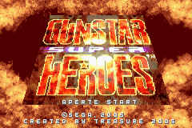
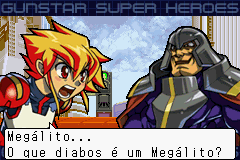
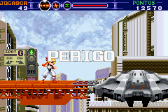

# Gunstar Super Heroes

## Informações sobre o jogo

| Tipo | Informação |
| ----------- | ----------- |
| Nome | Gunstar Super Heroes |
| Plataforma | [Game Boy Advance](../) |
| Desenvolvedora | Treasure |
| Distribuidora | SEGA |
| Gênero | Run 'n gun |
| Data de Lançamento | 25/10/2005 |

## Informações sobre a tradução

| Tipo | Informação |
| ----------- | ----------- |
| Versão | 1\.0 |
| Última versão | Sim |
| Data de Lançamento | 05/05/2007 |
| Percentual traduzido | 85% |

## Autores

| Autor(a) | Papel na tradução |
| ----------- | ----------- |
| [Kmikz](../../../autores/kmikz/) | Completo |
| [Fallen\_Soul](../../../autores/fallen_soul/) | Tradução |
| [Anime\_World](../../../autores/anime_world/) | Romhacking |
| [spyblack](../../../autores/spyblack/) | Gráficos |

## Grupos

* [Trans\-Center](../../../grupos/trans-center/)

## Informações sobre patching

| Aplicar o patch no arquivo | CRC32 Hash | MD5 Hash |
| ----------- | ----------- | ----------- |
| Gunstar Super Heroes \(U\)\.gba | 7CD86B02 | A5B75829DEBC9262B08076A94C8473EB |

## Páginas sobre a tradução

| URL | Oficial (publicado pelos autores) | Possuí link de download |
| ----------- | ----------- | ----------- |
| [https://romhackers.org/traducoes/portatil/game-boy-advance/gunstar-super-heroes-trans-center/](https://romhackers.org/traducoes/portatil/game-boy-advance/gunstar-super-heroes-trans-center/) | Não | Sim |
| [https://www.zophar.net/translations/gameboy-advance/brazilian-portuguese/gunstar-super-heroes.html](https://www.zophar.net/translations/gameboy-advance/brazilian-portuguese/gunstar-super-heroes.html) | Não | Sim |

## Imagens da tradução

