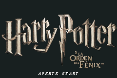
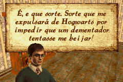
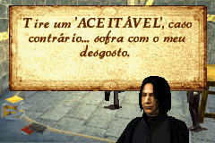

# Harry Potter and the Order of the Phoenix

## Informações sobre o jogo

| Tipo | Informação |
| ----------- | ----------- |
| Nome | Harry Potter and the Order of the Phoenix |
| Plataforma | [Game Boy Advance](../) |
| Desenvolvedora | Warner Bros. Interactive Entertainment |
| Distribuidora | Electronic Arts (EA) |
| Gênero | Intererativo |
| Data de Lançamento | 10/07/2007 |

## Informações sobre a tradução

| Tipo | Informação |
| ----------- | ----------- |
| Última versão | Sim |
| Data de Lançamento | 01/09/2010 |
| Percentual traduzido | 80% |

## Autores

| Autor(a) | Papel na tradução |
| ----------- | ----------- |
| [Makinadomal94](../../../autores/makinadomal94/) | Completo |

## Informações sobre patching

| Aplicar o patch no arquivo | CRC32 Hash | MD5 Hash |
| ----------- | ----------- | ----------- |
| Harry Potter and The Order of The Phoenix \(UE\) \(M7\)\.gba | 302B8B3D | 3A92A2D56665A8AA1640FC276095659A |

## Páginas sobre a tradução

| URL | Oficial (publicado pelos autores) | Possuí link de download |
| ----------- | ----------- | ----------- |
| [https://romhackers.org/traducoes/portatil/game-boy-advance/harry-potter-and-the-order-of-the-phoenix-makinadomal94/](https://romhackers.org/traducoes/portatil/game-boy-advance/harry-potter-and-the-order-of-the-phoenix-makinadomal94/) | Não | Sim |
| [https://www.zophar.net/translations/gameboy-advance/brazilian-portuguese/harry-potter-and-the-order-of-the-phoenix.html](https://www.zophar.net/translations/gameboy-advance/brazilian-portuguese/harry-potter-and-the-order-of-the-phoenix.html) | Não | Sim |

## Imagens da tradução

