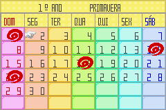

# Harvest Moon - Friends of Mineral Town

## Informações sobre o jogo

| Tipo | Informação |
| ----------- | ----------- |
| Nome | Harvest Moon \- Friends of Mineral Town |
| Plataforma | [Game Boy Advance](../) |
| Desenvolvedora | Victor Interactive Software |
| Distribuidora | Natsume |
| Gênero | Simulação |
| Data de Lançamento | 17/11/2003 |
| Descrição | O jogador tem como objetivo cuidar de uma fazenda e obter lucro com colheitas, produtos de seus animais como ovos e leite, e viver feliz com uma garota\. |

## Informações sobre a tradução

| Tipo | Informação |
| ----------- | ----------- |
| Versão | 1\.5 |
| Última versão | Sim |
| Data de Lançamento | 15/11/2020 |
| Percentual traduzido | 85% |

## Autores

| Autor(a) | Papel na tradução |
| ----------- | ----------- |
| [Pinguimbozo](../../../autores/pinguimbozo/) | Completo |

## Informações sobre patching

| Formato do patch | Aplicar o patch no arquivo | CRC32 Hash | MD5 Hash |
| ----------- | ----------- | ----------- | ----------- |
| IPS | Harvest Moon \- Friends of Mineral Town \(U\) \[\!\]\.gba | 8E923168 | 80355C831A7A25B0F70DC021EBD344F1 |

## Páginas sobre a tradução

| URL | Oficial (publicado pelos autores) | Possuí link de download |
| ----------- | ----------- | ----------- |
| [https://www.romhacking.net.br/index.php?topic=1659](https://www.romhacking.net.br/index.php?topic=1659) | Sim | Sim, porém é necessário realizar login |
| [https://romhackers.org/traducoes/portatil/game-boy-advance/harvest-moon-friends-of-mineral-town-pinguimbozo/](https://romhackers.org/traducoes/portatil/game-boy-advance/harvest-moon-friends-of-mineral-town-pinguimbozo/) | Não | Não |
| [https://joao13traducoes.com/2021/07/gba-harvest-moon-friends-of-mineral-town-pinguimbozo/](https://joao13traducoes.com/2021/07/gba-harvest-moon-friends-of-mineral-town-pinguimbozo/) | Não | Sim, porém o arquivo ou página de download exige uma senha |

## Imagens da tradução

