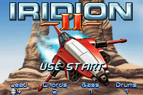
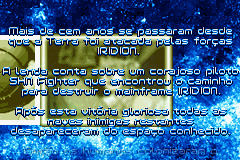
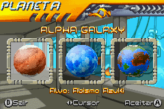

# Iridion II

## Informações sobre o jogo

| Tipo | Informação |
| ----------- | ----------- |
| Nome | Iridion II |
| Plataforma | [Game Boy Advance](../) |
| Desenvolvedora | Shin'en |
| Distribuidora | Majesco Games |
| Gênero | Shoot 'em up |
| Data de Lançamento | 29/05/2003 |

## Informações sobre a tradução

| Tipo | Informação |
| ----------- | ----------- |
| Versão | 1\.0 |
| Última versão | Sim |
| Data de Lançamento | 01/02/2011 |
| Percentual traduzido | None% |

## Autores

| Autor(a) | Papel na tradução |
| ----------- | ----------- |
| [vince\_vng](../../../autores/vince_vng/) | Completo |

## Informações sobre patching

| Aplicar o patch no arquivo | CRC32 Hash | MD5 Hash |
| ----------- | ----------- | ----------- |
| Iridion II \(U\) \[\!\]\.gba | DD8A7104 | 553E8C9A80190617EC13FA2A06487F2D |

## Páginas sobre a tradução

| URL | Oficial (publicado pelos autores) | Possuí link de download |
| ----------- | ----------- | ----------- |
| [https://romhackers.org/traducoes/portatil/game-boy-advance/iridion-ii-vince_vng/](https://romhackers.org/traducoes/portatil/game-boy-advance/iridion-ii-vince_vng/) | Não | Sim |
| [https://www.zophar.net/translations/gameboy-advance/brazilian-portuguese/iridion-ii.html](https://www.zophar.net/translations/gameboy-advance/brazilian-portuguese/iridion-ii.html) | Não | Sim |

## Imagens da tradução

