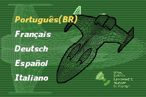
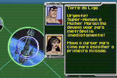
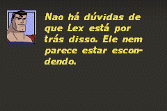
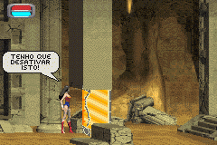

# Justice League - Injustice For All

## Informações sobre o jogo

| Tipo | Informação |
| ----------- | ----------- |
| Nome | Justice League \- Injustice For All |
| Plataforma | [Game Boy Advance](../) |
| Desenvolvedora | Saffire |
| Distribuidora | Midway |
| Gênero | Ação / Plataforma |
| Data de Lançamento | 06/12/2002 |

## Informações sobre a tradução

| Tipo | Informação |
| ----------- | ----------- |
| Versão | 1\.0 |
| Última versão | Sim |
| Data de Lançamento | 22/04/2004 |
| Percentual traduzido | 100% |

## Autores

| Autor(a) | Papel na tradução |
| ----------- | ----------- |
| [Antígeno](../../../autores/antigeno/) | Completo |

## Grupos

* [Made In Brasil \(MIB\)](../../../grupos/made-in-brasil-mib/)

## Informações sobre patching

| Aplicar o patch no arquivo | CRC32 Hash | MD5 Hash |
| ----------- | ----------- | ----------- |
| Justice League \- Injustice for All \(E\) \(M5\)\.gba | D71C4382 | 8D2F6A78E9CF3210AE22C5F111624E55 |

## Páginas sobre a tradução

| URL | Oficial (publicado pelos autores) | Possuí link de download |
| ----------- | ----------- | ----------- |
| [https://romhackers.org/traducoes/portatil/game-boy-advance/justice-league-injustice-for-all-mib/](https://romhackers.org/traducoes/portatil/game-boy-advance/justice-league-injustice-for-all-mib/) | Não | Sim |
| [https://www.zophar.net/translations/gameboy-advance/brazilian-portuguese/justice-league-injustice-for-all.html](https://www.zophar.net/translations/gameboy-advance/brazilian-portuguese/justice-league-injustice-for-all.html) | Não | Sim |

## Imagens da tradução

