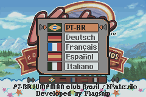
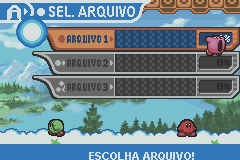
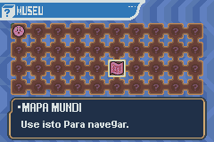
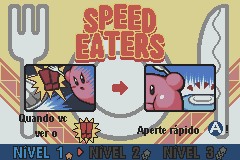
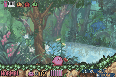

# Kirby &amp; the Amazing Mirror

## Informações sobre o jogo

| Tipo | Informação |
| ----------- | ----------- |
| Nome | Kirby &amp; the Amazing Mirror |
| Plataforma | [Game Boy Advance](../) |
| Desenvolvedora | Flagship |
| Distribuidora | Nintendo |
| Gênero | Ação / Plataforma |
| Data de Lançamento | 28/04/2004 |
| Descrição | A bola rosa tem como objetivo recolher os diferentes pedaços de um espelho mágico, que estão escondidos em um grande labirinto semelhante ao de jogos como &quot;Metroid&quot; e &quot;Castlevania&quot; \- só que muito mais simples\. Ao contrário desses outros jogos, Kirby não ganha poderes permanentes que permitem que ele acesse novas áreas\. Seguindo a tradição da série, é preciso encontrar um dos diversos inimigos e comê\-los para ganhar um dos vários poderes que permitem descobrir algumas das rotas alternativas\.

A exploração do mundo é simples e um mapa ajuda a compreender que caminhos tomar e quais partes já foram visitadas, mas a experiência como um todo é confusa demais\. Ao invés dos corredores lógicos das outras séries mencionadas acima, &quot;Amazing Mirror&quot; é composto por diversas telas conectadas de maneira arbitrária \- acabando com qualquer continuidade\. Isso promete desorientar muita gente, a não ser que você abra o mapa a cada 30 segundos\. |

## Informações sobre a tradução

| Tipo | Informação |
| ----------- | ----------- |
| Versão | 1\.0 |
| Última versão | Sim |
| Data de Lançamento | 08/06/2018 |
| Percentual traduzido | 100% |

## Autores

| Autor(a) | Papel na tradução |
| ----------- | ----------- |
| [Put@ Véa](../../../autores/put-vea/) | Completo |

## Grupos

* [JumpManClub Brasil](../../../grupos/jumpmanclub-brasil/)

## Informações sobre patching

| Aplicar o patch no arquivo | CRC32 Hash | MD5 Hash |
| ----------- | ----------- | ----------- |
| Kirby &amp; the Amazing Mirror \(E\) \(M5\)\.gba | 4F07C618 | 1C759EDF84A20174989588664BBBEC55 |

## Páginas sobre a tradução

| URL | Oficial (publicado pelos autores) | Possuí link de download |
| ----------- | ----------- | ----------- |
| [https://www.jumpmanclubbrasil.com.br/p/blog-page_8.html](https://www.jumpmanclubbrasil.com.br/p/blog-page_8.html) | Sim | Sim |
| [https://www.jumpmanclubbrasil.com.br/2018/02/projeto-de-traducao-kirby-and-amazing.html](https://www.jumpmanclubbrasil.com.br/2018/02/projeto-de-traducao-kirby-and-amazing.html) | Sim | Não |
| [https://www.romhacking.net.br/index.php?topic=703](https://www.romhacking.net.br/index.php?topic=703) | Sim | Sim, porém é necessário realizar login |
| [https://joao13traducoes.com/2018/06/gba-kirby-amazing-mirror-jumpmanclub-brasil/](https://joao13traducoes.com/2018/06/gba-kirby-amazing-mirror-jumpmanclub-brasil/) | Não | Sim, porém o arquivo ou página de download exige uma senha |

## Imagens da tradução

