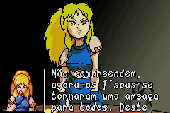
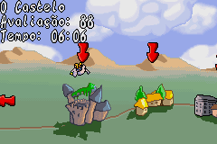

# Lady Sia

## Informações sobre o jogo

| Tipo | Informação |
| ----------- | ----------- |
| Nome | Lady Sia |
| Plataforma | [Game Boy Advance](../) |
| Desenvolvedora | RFX Interactive |
| Distribuidora | TDK Mediactive |
| Gênero | Ação / Plataforma |
| Data de Lançamento | 30/09/2001 |

## Informações sobre a tradução

| Tipo | Informação |
| ----------- | ----------- |
| Versão | 1\.1 |
| Última versão | Sim |
| Data de Lançamento | 23/06/2004 |
| Percentual traduzido | 80% |

## Autores

| Autor(a) | Papel na tradução |
| ----------- | ----------- |
| [Leo X](../../../autores/leo-x/) | Completo |

## Grupos

* [IPS Center](../../../grupos/ips-center/)

## Informações sobre patching

| Aplicar o patch no arquivo | CRC32 Hash | MD5 Hash |
| ----------- | ----------- | ----------- |
| Lady Sia \(U\) \(M6\) \[\!\]\.gba | 139E95BD | 94B847814FEE8E4E5D9FDBF1D3D25107 |

## Páginas sobre a tradução

| URL | Oficial (publicado pelos autores) | Possuí link de download |
| ----------- | ----------- | ----------- |
| [https://romhackers.org/traducoes/portatil/game-boy-advance/lady-sia-ips-center/](https://romhackers.org/traducoes/portatil/game-boy-advance/lady-sia-ips-center/) | Não | Sim |
| [https://www.zophar.net/translations/gameboy-advance/brazilian-portuguese/lady-sia.html](https://www.zophar.net/translations/gameboy-advance/brazilian-portuguese/lady-sia.html) | Não | Sim |

## Imagens da tradução

